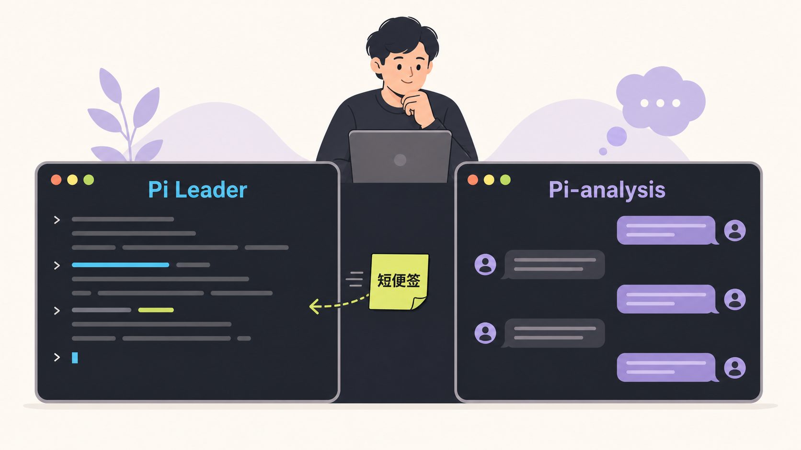

# Research Pi

> Session is not enough for research. Project is.

Coding Agent不一定是好用的Research Agent。

Research Pi 面向 AI、机器人、通信、优化与仿真等计算实验科研。它最关心的不是“代码写的对不对”，而是：**代码能否支撑实验？这个实验告诉了我们什么？下一步高信息增益的实验是什么？**

它不是一段更长的科研提示词，也不是一个号称能自动完成科研的 skill。它把项目进度、实验记录、讨论和 Agent 协作留在 Project 中，因此换一个 Session、换一个模型，也不用从头讲起。

`Pi Core 0.84.2` ·  `macOS / Linux / WSL2`

## 设计原则

1. **项目比对话更长寿**：Session 可以结束，模型可以更换，但研究问题、实验结果和关键决定应该留下来。
2. **科研必须要人参与**：Agent 可以查资料、写代码、跑实验和整理证据，但不会因为命令成功就擅自宣布“方向成立”。
3. **记住真正有用的东西**：重点保留问题、假设、证据、失败路线和下一步，而不是把所有聊天都塞回模型上下文。
4. **让不同模型做擅长的事**：Pi 把握研究主线，Codex 负责长程执行，Pi-analysis 陪用户理解、质疑和讨论。它们交换的是短消息，不是彼此整段复制上下文。
5. **先找到对的方向，再把代码写漂亮**：探索阶段允许大胆替换、快速试错和整体回滚；方向值得保留后，再补工程质量与复现能力。

## 我最喜欢的设计：双 Session 工作流

得益于记忆、通信、权限机制的良好设计，Research Pi 可以同时开两个窗口：一边让 **Pi Leader** 推进实验，另一边在 **Pi-analysis** 里随时追问、质疑和展开想法。



Pi-analysis 的长对话留在自己的窗口里，不会挤进 Leader 的上下文。只有当讨论形成了值得主线知道的判断，才把它整理成一张短便签送过去。

用户可以在一个终端让 Pi Leader 持续工作，在另一个终端随时进入 Pi-analysis：

```sh
# Terminal A：持续推进科研主线
pi

# Terminal B：跟进、理解和讨论，不干扰 Leader
pi --analysis
```

Pi-analysis 看到的是同一个项目的最新工作视图，但它有自己的对话空间。讨论可以很长，真正发给 Leader 的只需要是一张简短“便签”：

```text
/analysis send 当前判断、关键依据、仍存不确定性与建议下一步
```

这张便签通过 mailbox 交给 Leader，只包含讨论后的判断、依据和建议，不会把整段聊天塞进主线。Leader 空闲时可以立即看到；如果它正在工作，便签会等到合适的时机再送达。

于是主线可以安静地跑，用户也始终有一张可以放心提问和思考的桌子。独立 Codex 讨论 Session 也能通过 `pi analysis context` / `pi analysis send` 使用同一张“便签”。

## 快速开始

要求 Node.js `>=22.19`。Research Pi 当前使用 Unix 风格的工具链；Windows 推荐通过 **WSL2** 使用，不建议直接在原生 PowerShell 中运行 Agent。

### macOS / Linux

```sh
npm install -g 'git+https://github.com/RosMarinas/Research-Pi.git#main'
pi setup
pi paths
```

### Windows（推荐 WSL2）

先在管理员 PowerShell 中安装 Ubuntu：

```powershell
wsl --install -d Ubuntu
```

随后打开 Ubuntu，先安装 Linux 版 Node.js `>=22.19`，再像 Linux 一样安装 `main`：

```sh
sudo apt update
sudo apt install -y git zsh ripgrep fd-find
node --version
npm --version
npm install -g 'git+https://github.com/RosMarinas/Research-Pi.git#main'
pi setup
pi paths
```

WSL2 本身就是 Linux 环境，因此可以直接使用 `main` 并获得最新功能。请把科研项目放在 `~/research/...` 等 WSL 文件系统中，不要放在 `/mnt/c` 或 `/mnt/d`。`windows-research-pi` 是额外阻断 Windows 挂载盘、`.exe` 和 PowerShell interop 的安全预览分支；需要给 Agent 较高自动执行权限时，可用它测试更严格的宿主隔离。

进入 TUI 后用 Pi 原生 `/login` 登录供应商，再用 `/model` 切换模型；Research Pi 不再维护第二套模型/profile 目录。若供应商使用 API key，或需要 DeepSeek 小型搜索，也可以在 `pi paths` 给出的 `credentialsPath` 中填写：

```dotenv
DEEPSEEK_API_KEY=...
ZAI_API_KEY=...
OPENCODE_API_KEY=...
```

然后在科研项目中启动：

```sh
cd /path/to/research-project
pi
```

如果只想阅读结果、讨论和分析，而不允许当前 Session 改代码或启动实验：

```sh
pi --analysis
```

首次接入现有项目时，可以直接说：

```text
先只读恢复当前研究状态：识别研究目标、竞争假设、已有证据、失效路线和关键未决问题。
不要立即启动大实验；先说明 ProjectView 缺少什么，以及下一步最有信息量的动作。
```

## 核心能力

| 能力 | 作用 |
|---|---|
| Research Contract | 让 Agent 默认采用探索、证伪、有效性检查和证据驱动收敛 |
| Project Runtime | 维护 Project State、Actors、Actions、mailbox 与 Leader Session 所有权 |
| Dual Session | Leader 持续推进主线，Pi-analysis 独立跟进与讨论，并只把最终短综合投递给 Leader |
| ProjectView | 用 compact 边界冻结一份简短 Project Brief，再把最新进展作为 Session 尾部 Delta 注入；新人能快速上手，旧状态也不会冒充当前结论 |
| Research Memory | 对历史 Session 和实验记录做本地全文检索，不依赖向量数据库 |
| Research Compaction | 在模型 settled 后生成带 provenance 的结构化状态，而不只摘要聊天文本 |
| Experiment Records | 用 `record_experiment` 区分观察、有效性和解释；支持换轨与窄幅状态修订 |
| Codex Collaboration | 以可续接 mission 调用 advisor/executor，并通过 Runtime mailbox 与 Pi 通信 |
| Project Boundary | 默认把模型命令限制在当前项目；SSH、外部文件和宿主命令通过显式 capability 授权 |
| Research Briefing | 在重大结果或阶段交接时恢复工作脉络，并把内部术语翻译成用户可判断的报告 |

ProjectView 分成两层：`/compact` 成功后生成一份固定、简短的 Project Brief，只介绍项目、最终目标、总体思路、用户关心的原则和已结束阶段；在下一次 compact 前，它的字节保持不变。当前路线、最新实验、运行状态和下一步放在每次模型调用最末尾的 ProjectView Delta 中，并替换旧 Delta。这样稳定前缀有利于缓存，新 Session 又不会只看到一份过时介绍。

## 常用入口

| 命令 | 用途 |
|---|---|
| `/runtime` | 查看 ProjectView、Actors、Actions、mailbox 和 Session 状态 |
| `/runtime rotate` | 新建不复制旧 transcript、但继承 Project 状态的 Leader Session |
| `pi --analysis` | 新开只读 Analysis Session；不抢占 Leader，不接收其 mailbox |
| `/analysis send <摘要>` | 把有价值的讨论投递给 Leader；用 `/runtime promote <原因>` 转为 Leader |
| `pi analysis context/send` | 让独立 Codex Session 读取 ProjectView 或向 Leader 投递不超过 1200 字符的综合 |
| `/runtime context <on\|off>` | Analysis 保持只读角色，只切换后续轮次是否注入 ProjectView |
| `/runtime new clean` | 新建不继承 ProjectView 的纯净 Session；用 `/runtime inherit` 恢复 |
| `/memory <query>` | 搜索当前 Project 的历史 Session 与实验记录 |
| `/side <问题>` | 隔离追问；有价值时用 `/side use <id>` 提升到主线 |
| `/watch` | 观察 Codex 的命令、文件修改和 subagent 活动，不污染 Leader 上下文 |
| `/actors`、`/inbox` | 查看活跃 Actor 和待处理 Runtime 消息 |
| `/login`、`/model`、`/scoped-models` | 使用 Pi 原生认证、模型切换和模型范围；Research Pi 不再复制供应商目录 |
| `/config` | 查看统一配置和切换主题 |
| `/boundary doctor` | 检查项目、Git、Python、sandbox 与 Codex 环境 |

模型可直接调用的研究工具包括 `record_experiment`、`record_research_transition`、`amend_project_state`、`research_checkpoint`、`research_memory_search/read`、`codex_delegate` 和 `host_capability`。

## 安全与数据

- 模型 shell 默认可读写当前项目和正常 Git 数据；其他项目、宿主凭据和 Unix socket 不自动开放。
- SSH target、项目外只读文件和宿主命令需要一次、当前 Session 或当前 Project 范围的明确批准。
- 私钥、`.env`、API key、keychain 和云凭据不能进入模型上下文。
- 配置、Session、Runtime、Codex job、授权账本和 trace 位于用户状态目录，不进入科研仓库。
- `pi-traced` 可能记录完整 prompt 与工具内容，只应短时诊断；默认 trace 和 Codex DEBUG SQLite 日志均关闭。

## 配置与目录

```text
~/.config/research-pi/        config.json、schema、credentials.env
~/.local/state/research-pi/   sessions、Runtime、memory、Codex、grants、trace
<research-project>/.pi/       项目实验记录与 checkpoint
```

实际路径以 `pi paths` 为准。Research Pi 的 `config.json` 只管理 Runtime、compact、Codex、搜索、资源与 UI；Leader 的供应商、模型、thinking 和自定义模型由 Pi 原生配置管理：

```sh
pi config show
# TUI 内：/login、/model、/scoped-models、/settings
```

Research Pi 关闭全局 skill/extension 自动发现，只显式加载审查过的 Harness 扩展、内置 `research-briefing` 和配置白名单。

## 开发与验证

```sh
git clone git@github.com:RosMarinas/Research-Pi.git
cd Research-Pi
npm install --ignore-scripts
cp .env.example .env
./install-user.sh

npm run check
npm test
npm run test:package
```

- `pi`：运行 Research Pi Harness。
- `pi-raw`：运行锁定的原始 Pi Core，便于行为对照。
- `pi-traced`：临时启用敏感 trace。
- `./run-pi.sh --workspace /path/to/project`：从源码 checkout 直接运行。

### Windows / WSL2

Windows 上的最小、安全迁移路线是 WSL2，而不是让现有 Bash harness 直接由 PowerShell 解释。请使用 `windows-research-pi` 分支，并把科研项目和 Research Pi 都放在 WSL 自身的 `/home/...` 文件系统中；`/mnt/c`、`/mnt/d` 等 Windows host mounts 不可作为 agent workspace。

该分支在启动时要求 WSL2、bubblewrap、socat、ripgrep、`fd`/`fdfind` 和可用的 seccomp helper，并执行无副作用的 Windows host-interop 探针。缺少 seccomp、项目位于 `/mnt` 或 `cmd.exe` 能从沙箱中成功启动时，边界会 fail closed。项目认可的 SSH target 可以持久自动使用；通用 host command/project script 在 WSL 下只能一次性批准，且不能访问 `/mnt` 或调用 Windows/PowerShell executable。安装步骤和边界说明见 [Windows / WSL2 指南](docs/windows-wsl-guide.md)。

## 文档

- [基本使用指南](docs/pi-basic-guide.md)
- [统一配置说明](docs/configuration.md)
- [Project Runtime 测试与恢复](docs/research-runtime-test-guide.md)
- [Windows / WSL2 安装与安全边界](docs/windows-wsl-guide.md)
- [安全模型与本地数据](docs/security-model.md)
- [设计思想](thesis/ResearchPi.pdf)


## License

Research Pi 的原创代码与文档采用 [MIT License](LICENSE)。第三方组件保留各自许可证，详见 [Third-Party Notices](THIRD_PARTY_NOTICES.md)。
