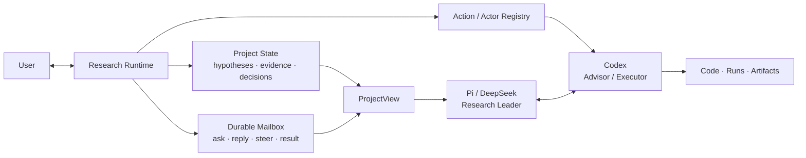

# Research Pi

> **让 Session 可以丢弃，让科研认知留下。**
>
> A project-centric cognitive runtime for computational research.

`Pi Core 0.84.1` · `DeepSeek V4 Pro / Flash` · `Codex App Server` · `macOS / Linux / WSL2`

Research Pi 面向 AI、机器人、通信、优化与仿真等计算实验科研。它不是给普通 coding agent 换一段“科研提示词”，而是把长期研究状态、Agent 协作、Session 交接、证据记忆与执行权限从单个模型的有限上下文中移出来，放到 **Project 级 Runtime** 中管理。

代码在这里首先是检验假设的实验仪器。系统优先回答：**这个想法是否成立、证据是否可信、下一步哪个实验最有信息量？** 等到方向值得保留后，再进入工程化和稳定交付。

[5 分钟上手](#5-分钟上手) · [核心思路](#核心思路) · [配置](#默认配置) · [Project Runtime](#project-runtime) · [安全边界](#project-boundary) · [完整指南](docs/pi-basic-guide.md)

## 为什么做 Research Pi

长程科研任务常常不是被模型能力本身卡住，而是被 Harness 的组织方式拖垮：

| 常见问题 | 直接后果 | Research Pi 的处理 |
|---|---|---|
| 一个 Session 同时规划、写代码、跑实验、读日志 | 工具输出淹没研究主线 | 主线由 Pi/DeepSeek 保持，工具密集任务可交给可续接的 Codex Actor |
| Agent 需要自己记住何时委派、何时压缩 | 上下文越差，越难做出正确的元决策 | Runtime 外置 Action/Session 状态并给出生命周期建议；自动路由仍是后续阶段 |
| 新 Session 必须重读 README、Git diff 和旧聊天 | 每次换模型或清理上下文都要重建项目认知 | Project State 被编译成限长 ProjectView，自动交给新的 Project-aware Session |
| Compact 只是把聊天记录重新摘要 | 失败路线、证据边界和有效性判断容易被压平 | Compact 同时提交结构化科研状态与 provenance；历史仍可精确检索 |
| “命令成功”被模型误当作“假设成立” | 操作事实与科学结论混淆 | Runtime 记录操作事实；研究结论仍由用户与 Research Leader 判断 |

## 核心思路



三个原则贯穿当前设计：

1. **Project ≠ Session**：Project 保存长期认知；Session 只是一个 Actor 的临时工作集。
2. **Message ≠ State ≠ Context**：发生过的事件、当前科研状态和某次模型调用需要看到的内容分别管理。
3. **执行完成 ≠ 科学结论成立**：退出码、patch 和 run ID 可以自动记录；实验是否有效、假设是否被支持不能自动推断。

> [!NOTE]
> 当前版本已经是可日常使用的 Project Runtime，但不是自动 AI Scientist。它支持 Project State、跨 Session Codex 协作、手动 Session rotation、clean Session 和 observe-only lifecycle recommendation；尚不自动拆任务、选择模型或启动科研路线。

## 5 分钟上手

### 1. 安装

要求 Node.js `>=22.19`。当前最直接的全局安装方式是从 GitHub `main` 获取已打包的 CLI：

```sh
npm install -g 'git+https://github.com/RosMarinas/Research-Pi.git#main'
```

如果已经通过本仓库的开发软链接安装过 `pi`，先在旧 checkout 中运行：

```sh
./install-user.sh --remove-dev-links
```

### 2. 配置 DeepSeek API key

```sh
pi setup
pi paths
```

`pi setup` 会创建权限为 `0600` 的配置和凭据模板。根据 `pi paths` 输出找到 `credentialsPath`，只在本机填写：

```dotenv
DEEPSEEK_API_KEY=你的_API_key
```

API key、Session、Runtime ledger、Codex 状态和 trace 都不会打包或提交到科研仓库。

### 3. 在科研项目中启动

```sh
cd /path/to/research-project
pi
```

首次进入目录时，Pi 会要求确认项目信任。启动后建议先使用：

```text
/config            选择 DeepSeek profile 与 TUI 主题
/boundary doctor   检查 Git、Python、sandbox 与 Codex 执行环境
/runtime            打开 Project Runtime 控制面
```

随后可以直接给出研究任务。一个适合首次接入现有项目的输入是：

```text
先只读取当前项目状态，识别研究目标、竞争假设、已有证据、失效路线和最关键的未决问题。
不要启动新实验；先告诉我 ProjectView 中缺了什么，以及下一步最有信息量的动作。
```

当当前对话已经形成可信的科研状态后，可执行一次 `/compact`，让结构化 Project State 成为后续 Session 的接手基线。

### 4. 记住这几个入口

| 入口 | 用途 |
|---|---|
| `/runtime` | 查看研究路线、Project memory、Actors、Actions、mailbox 与 Session 状态 |
| `/side <问题>` | 隔离追问，不污染主线；有价值时再 `/side use <id>` |
| `/memory <query>` | 搜索当前 Project 的历史 Session 与实验记录，不使用向量数据库 |
| `/watch` | 直接观察 Codex executor/advisor 的客观执行过程 |
| `/config` | 切换 DeepSeek Pro/Flash、thinking 与 Ocean/Graphite/Ember 主题 |
| `/runtime new clean` | 新建不继承 ProjectView 的纯净 Session；需要时用 `/runtime inherit` 恢复 |

完整命令见 [Pi 基础使用指南](docs/pi-basic-guide.md)，所有配置字段见 [统一配置说明](docs/configuration.md)，Runtime 跨 Session 验收见 [Research Runtime 测试指南](docs/research-runtime-test-guide.md)。

## 安装方式与目录

### 日常使用：全局 CLI

全局安装后，程序、用户配置与运行状态彼此分离：

```text
npm 全局目录                  Research Pi 程序与锁定依赖
~/.config/research-pi/        config.json、schema 与 credentials.env
~/.local/state/research-pi/   sessions、Project Runtime、memory、Codex jobs、grants、trace
<research-project>/.pi/       该项目自己的实验记录与 checkpoint
```

XDG 路径或平台不同时，以 `pi paths` 的实际输出为准。发布稳定 tag 后，也可以把安装命令中的 `#main` 替换为明确版本，例如 `#v0.2.0`。

### Harness 开发：源码 checkout

本仓库同时是 Research Pi 的快速开发 checkout。修改 extension、policy、prompt 或 TUI 后，`./run-pi.sh` 会立即使用新代码：

```sh
git clone git@github.com:RosMarinas/Research-Pi.git
cd Research-Pi
npm install --ignore-scripts
cp .env.example .env
# 编辑 .env，填入 DEEPSEEK_API_KEY
./install-user.sh
```

`./install-user.sh` 创建的是指向当前 checkout 的开发软链接。移动或删除 checkout 会使它失效；准备回到全局包时，先运行 `./install-user.sh --remove-dev-links`。

### Windows / WSL2

Windows 上的最小、安全迁移路线是 WSL2，而不是让现有 Bash harness 直接改由 PowerShell 解释。请使用 `windows-research-pi` 分支，并把科研项目和 Research Pi 都放在 WSL 自身的 `/home/...` 文件系统中；`/mnt/c`、`/mnt/d` 等 Windows host mounts 不可作为 agent workspace。

该分支在启动时要求 WSL2、bubblewrap、socat、ripgrep 和可用的 seccomp helper，并执行一次无副作用的 Windows host-interop 探针。缺少 seccomp、项目位于 `/mnt` 或 `cmd.exe` 能从沙箱中成功启动时，边界会 fail closed。安装步骤和边界说明见 [`docs/windows-wsl-guide.md`](docs/windows-wsl-guide.md)。

## 命令入口

- `pi`：加载 Research Pi harness。
- `pi-traced`：额外记录模型、工具与时延 trace；trace 可能包含敏感内容，仅按需使用。
- `pi-raw`：直接运行锁定的 Pi Core，用于与 harness 行为进行对照。

开发安装器默认在 `${XDG_BIN_HOME:-$HOME/.local/bin}` 创建符号链接，不覆盖已经存在的同名文件。移动或删除 checkout 会使该开发入口失效；稳定使用应安装打包版本。

## 默认配置

- Pi Core：`0.84.1`
- Provider：`deepseek`
- Active profile：`deepseek-pro`
- Model：`deepseek-v4-pro`（可持久切换到 `deepseek-flash`）
- Endpoint：`https://api.deepseek.com`
- Thinking level：`max`（通过官方 `reasoning_effort: "max"` 启用；384K 是最大输出上限，不是输入上下文或压缩阈值）

### 单一配置入口

普通行为配置统一放在一份 JSON 中：

- 源码开发：`.pi/config.json`（本地生成、Git 忽略、每个 worktree 独立）；
- 稳定安装：`~/.config/research-pi/config.json`；
- 审查过的初始模板：`.pi/config.defaults.json`；
- API key：仍在 `.env` 或 `credentials.env`，永远不进入 config。

这份 config 统一管理 leader model profiles、Pi Core settings、Codex advisor/executor defaults、research compact、Web Search、skill 白名单、TUI 选项与 diagnostics。安全边界、凭据内容和不可破坏的恢复 invariant 不作为普通偏好开关。

常用入口：

```sh
pi config show                    # 查看完整生效配置
pi config path                    # 找到配置文件
pi config list                    # 列出模型 profiles
pi config use deepseek-flash      # 持久切换默认 profile
pi --profile deepseek-pro         # 只覆盖本次启动
```

交互界面输入 `/config` 会打开居中的原生 TUI profile 面板；选择后立即切换当前 Session 的模型与 thinking，并持久保存。面板中按 `t` 可切到 Theme 选择器；也可用 `/config theme research-pi|research-graphite|research-ember|dark|light`。默认不重复显示 `◇ profile`，实际 model/thinking 继续由 Pi 原生 footer 展示。

Research Pi 会从 config 生成内部 Pi `settings.json/models.json` adapter；这些文件位于状态目录，用户不再手工维护。源码模式沿用 Git 忽略的 `.pi/agent/`，已有 trust、trace 等本地状态不需要迁移。`.pi/APPEND_SYSTEM.md` 和 `.pi/extensions/` 仍分别承载稳定 Research Contract 与受审查扩展代码。

运行其他科研仓库时，该仓库自身的 `AGENTS.md` 等项目上下文仍会正常加载。

最终 system prompt 由 Pi 原生的动态工具说明、Research Contract、目标项目上下文、白名单 skill 与当前工作目录共同构成。`research-mode` 扩展只把原生的 “coding assistant” 身份句稳定替换为 “computational research agent”；它不覆盖动态工具说明，也不在每轮加入时间、状态或随机内容。如果目标项目提供自定义 `SYSTEM.md`，该身份替换不会擅自改写它。

## Skill 白名单

启动器使用 Pi 原生的 `--no-skills` 关闭全局和项目 skill 自动发现，再从 `config.json` 的 `resources.skills` 通过 `--skill` 加载经过检查的默认白名单：

- `~/.agents/skills/cognitive-knowledge-network`：研究概念、方法和证据导航；
- `~/.codex/skills/remote-workspace`：远程环境、实验和 GPU 执行。

其他 skills 不会因为存在于 `~/.agents/skills/`、`.agents/skills/` 或 `.pi/skills/` 而自动进入上下文。需要临时启用时，仍可使用 Pi 原生命令行参数：

```sh
pi --skill /path/to/skill
```

白名单 skill 在当前机器不存在时会被跳过并给出提示，不影响 Pi 启动。

同理，启动器使用 `--no-extensions` 关闭目标项目和用户目录中的可执行 extension 自动发现，只显式加载本仓库审查过的 harness extensions。需要临时加载目标项目 extension 时必须由用户在启动命令中明确传入 `--extension /path/to/extension.ts`；这属于宿主代码执行授权，不受模型 shell 沙箱保护。

## 科研扩展

### Project Boundary

模型发起的 shell 使用 Pi 官方示例采用的 sandbox runtime，在 macOS 上落到 Seatbelt、Linux 上落到 bubblewrap/seccomp；Codex executor 使用 Codex permission profile。两者默认只能读取必要的系统运行路径，并可读写当前科研项目。项目内允许大步修改、删除和自由 Git commit；Git objects、index、refs 与 config 可写，`.git/hooks` 保持只读。Harness 只从用户级 Git 配置提取 `user.name` / `user.email` 注入提交环境，不暴露其余全局 Git 配置。普通 Web 客户端通过开放审批代理访问公网；OpenSSH 这类原始 TCP 客户端必须使用下面的显式 host capability。Unix socket、宿主凭据与其他目录不会自动继承。

macOS 启动时由可信宿主侧解析活动的 `xcode-select -p`，将该 Developer 目录只读加入 Pi/Codex 的共享系统运行时策略，并显式设置 `DEVELOPER_DIR`。因此 `/usr/bin/git`、系统 Python 和编译工具不需要读取整个用户目录。每个 Codex job 在模型执行前先运行无模型 sandbox preflight；Git 或系统运行时不可用时立即失败，不消耗模型调用。可随时执行：

```text
/boundary doctor
```

或在终端执行：

```sh
pi doctor --workspace /path/to/research-project
```

### Host capability

普通 `uv`、Python、shell、Node、Git 和测试命令在项目 sandbox 内直接运行，不按命令名称或 `-c` 字符串做白名单判断。当科研任务确实需要读取项目外资料、连接实验服务器，或让项目命令使用宿主 SSH/config/agent 等权限时，使用 `host_capability`。授权有三种作用域：一次、当前 Pi session（24 小时）和当前项目持久信任；Pi 与 Codex job 共用同一组规则：

- `external-read` 只允许一个精确文件，或显式批准目录下的读取；私钥、`.env`、云凭据与 keychain 等不能授权给模型读取；
- `ssh-target` 只允许一个精确 `[user@]host[:port]`，系统 SSH 可以不透明地使用 `~/.ssh/config`、私钥或 `SSH_AUTH_SOCK`，但凭据内容不会进入模型、prompt、job 或日志；
- `host-command` 以 `shell:false` 执行明确 argv，工作目录必须位于当前项目。一次/session 授权匹配完整 argv；项目信任匹配界面显示的结构化前缀，例如 `uv run remote_run.py`、`python3 remote_run.py` 或 `./sync.sh`，因此实验参数可以变化而无需反复批准；
- `sh -c`、`bash -c`、`python3 -c`、`node -e` 等代码字符串默认只建议把完整 argv 作为持久规则，不会退化成信任整个解释器；
- `project-script` 保留为兼容用的最严格模式：绑定项目内文件的精确 SHA-256 与精确 argv；
- Codex advisor 只能使用外部只读授权；executor 可复用项目认可的 SSH target 和 command prefix。

可以让模型直接调用 `host_capability` 并在弹窗中批准，也可以由用户预先执行：

```text
/boundary grant-read "~/.ssh/config"
/boundary trust-ssh 931server
/boundary trust-command uv run remote_run.py
/boundary trust-command python3 remote_run.py
/boundary trust-command ./sync.sh
/boundary grant-command python3 -c "print('one exact host-side probe')"
/boundary grant-script ./sync.sh --once
/boundary grants
/boundary revoke <grant-id|all>
```

`/boundary` 显示当前边界和 grant 数量。`grant-*` 是当前 session 规则，`trust-*` 是按项目根目录隔离的持久规则；两者都可随时 revoke。授权账本位于当前状态目录的 `capabilities/`（源码开发模式即 Git 忽略的 `.pi/capabilities/`），不会打包或进入 Git；它只保存项目哈希、目标、scope、到期时间、argv 前缀及兼容脚本哈希，不保存密钥。

`host-command` 是显式离开 sandbox 的宿主执行：它继承用户账号可用的运行时环境与 SSH agent，因此比不透明 `ssh-target` 更强。界面会同时显示完整 argv、cwd 和建议持久前缀，只有用户授权后才能执行。shell sandbox 越界时，Pi 应优先通过该 broker 申请一次或项目规则并继续当前任务；只有 broker 无法表达操作时才退回人工 `!` / `!!` 通道。

### Tool Activity

所有模型工具调用都会在 Pi 底部状态栏显示工具名、安全截断后的目标摘要、运行时间和成功/失败终态；并行调用显示当前数量与最近启动的工具。普通工具终态保留 5 秒，`codex_delegate` 的后台 job 另有持久状态，不会因委派工具返回而消失。

运行 `/watch` 可按需打开紧凑的 Codex 执行 overlay；它不会长期占据编辑区。`←/→` 切换当前项目可见的 Codex Action，`Tab` 或 `↑/↓` 在 overview、activity、agents 三个视图间切换，`r` 刷新，`q`/`Esc` 关闭。agents 视图展示当前 Action 内部 subagent 的 thread、路径、状态、模型和最近消息。面板直接读取脱敏的 App Server 客观事件，展示命令、退出码与限长输出尾部、文件修改、MCP/动态工具、搜索以及 Codex 内部 subagent 状态；不会经过 Research Leader 转述，也不会进入 DeepSeek 上下文。

### Research Mode

Research Pi 默认处于探索与验证阶段：构造竞争假设，优先高信息增益且可逆的实验，将代码视为实验工具，并在证据支持路线或用户要求稳定交付后才进入收敛工程阶段。完成标准是研究判断得到推进，而不是代码发生修改。

### `record_experiment`

当一次运行会改变后续研究判断时，记录假设、介入、预期、有效性检查、观察与下一步。记录写入目标科研项目的 `.pi/research/experiments.jsonl`，该文件默认不应进入版本控制。若结果在换轨后才返回，可显式填写原 `trackRef`，避免把旧路线实验误标为当前路线证据。

### `record_research_transition`

只在研究问题或实验路线实质换轨时记录旧路线处置、新 active track、理由、依据与下一决策。普通 next step、代码重构或 Codex completed 不触发；旧证据保留为可检索的 contract-bound 历史，不会因换轨被重写。已有 parallel 分支时，只有继续非 primary 路线才显式提供其精确 `fromTrackRef`。

### `amend_project_state`

当 ProjectView 只有局部字段已被用户决策、实验、run 或权威文档明确纠正时，Research Leader 可直接提交一个窄 patch，不必为了改一句 claim 或 next experiment 重新 compact 整段会话。工具必须携带最新 `Project revision`、理由和 authority refs；revision 已变化、当前 Session 不再持有 Leader attachment、目标 state 属于 retired route 或当前是 clean Session 时都会拒绝。写入是 append-only，旧 state 不被原地覆盖；省略字段保持不变，数组字段整体替换，`nextExperiment` 只合并显式提供的子字段。初始综合仍用 `/compact`，实质换轨仍用 `record_research_transition`。

### `research_checkpoint`

在大步实验修改、回滚或废弃路线前，为当前已跟踪 Git 状态创建独立的研究 checkpoint，不切换分支，也不修改工作树。

### Research Memory

`research_memory_search` 和 `research_memory_read` 为模型提供按需历史检索。原始 session JSONL 和实验账本仍是事实源；状态目录中的 `memory/memory.sqlite` 只是可删除、可重建的派生索引。

- 使用 SQLite FTS5，不使用 embeddings 或向量数据库；
- 中文使用 trigram，短 run ID 使用受限子串回退；
- 默认只检索当前 Git 项目，排除当前 session 和废弃分支；
- 实验记录、用户陈述、助手综合和 compact 摘要带有不同 reliability；
- 常见 API key、token 和 password 形式在写入索引前会脱敏，但原始 session 本身仍应视为敏感数据。

人类可使用 `/memory <query>` 查看前三条结果；该命令不把结果加入模型上下文。它不会自动在每轮注入旧会话。

### Side 对话

`/side <问题>` 使用当前可见上下文发起一次隔离调用，并把完整问答保存为 session custom entry。它不会自动进入后续主对话上下文，因此适合临时追问、替代解释和有价值但暂时不应污染主线的想法。

- 卡片折叠时显示问题和答案预览，`Ctrl+O` 展开完整 Markdown；
- `/side list` 列出当前会话分支的 side 对话；
- `/side show <id>` 单独查看完整内容；
- `/side use <id>` 显式把选中的问答提升到主上下文；
- side 内容会进入 Research Memory，可靠性按 assistant synthesis 处理。

### Web Search

`web_search` 通过 DeepSeek Anthropic-compatible API 的原生 Web Search 做简单、直接、带结构化来源的当前信息检索，复用同一个 `DEEPSEEK_API_KEY`，无需额外搜索服务密钥。搜索模型、thinking budget、默认搜索次数与来源上限来自 `config.json` 的 `research.search`。若 API 没有返回结构化来源，工具会明确标为未核验模型综合。

Pi 可直接完成有界的小型调研；当用户指定，或任务确实需要大量搜索、交叉核验和中间材料整理时，再交给 Codex 隔离过程。

### Research Compaction

DeepSeek V4 Pro/Flash 使用 Max reasoning，但不把 1M 容量等同于等质量注意力。默认在约 272K 总上下文时标记软 compact，384K 作为硬触发线；阈值与 recent-tail schedule 由 `config.json` 的 `research.compaction` 管理。真正压缩只在当前 agent run（包括工具调用链）完整 settled 后开始，不会为压缩 abort 尚未完成的科研任务。默认 recent tail 按当前分支第 1/2/3 次 compact 取约 32K/40K/48K，之后固定在 48K。结构化研究状态和可检索历史负责承接更早证据。

`/compact` 或自动 compact 时，扩展同时生成：

- 给模型继续工作的科研状态摘要；
- 存在 compaction entry `details` 中的结构化 `researchState`、evidence ledger 和 provenance。

强结论必须引用有效的 `record_experiment` entry；仅引用无效或 inconclusive 运行的 supported/weakened/rejected 状态会被降级。实验记录同时镜像为精简的 project-level evidence，同一 Git Project 的其他已知 worktree 可索引原 ledger。模型输出不能解析或校验时，自动回退到 Pi 原生 compact。使用 `/research-state` 可检查最近一次结构化状态。

### Codex Executor

`codex_delegate` 将本地 Codex CLI 作为上下文隔离的执行器或顾问，Pi 继续负责研究问题、假设、证据判断和下一步决策。

- `advisor`：只读分析，模型与 reasoning 默认值来自 `config.json` 的 `codex.advisor`；
- `executor`：完整执行任务，模型与 reasoning 默认值来自 `codex.executor`，自动使用 project-write permission profile；
- 每次调用都可覆盖 Codex model 和 reasoning effort；
- executor 可在项目内修改或删除文件、安装项目依赖、自由提交，以及启动或取消昂贵实验；经过用户授权后，它还可通过 `research_pi_host` 使用精确外部只读、SSH target 和固定脚本，不需要复制凭据或重开 delegation；
- Codex 通过本地 stdio App Server 运行，保存稳定的 thread/turn ID；长任务默认后台运行，通过同一个工具的 `status`、`result`、`respond`、`steer`、`resume`、`cancel` 和 `reconcile` action 管理；
- 连续处理同一研究子任务时，Pi 会给它稳定的 `mission` 标签并使用 `reuse=auto`：只有同一精确 workspace、mission、advisor/executor mode 和 research track 才自动续接原 thread。跨 Pi Session 可以复用；换轨后即使复用了旧 mission 也会新建 thread。独立批判、主动清除旧假设或另一 worktree 应使用新 mission；
- `/codex missions` 查看当前 project workspace 按 research track 分组的 mission/thread 链。新 job 由 `projectKey + research-leader Actor` 所有，不再绑定一个 conversation branch；文件操作仍强制绑定原精确 workspace。续接前会比较上次终态与当前 Git snapshot；显式跨 track 恢复旧 thread 时还会加入醒目的 route-change 提示，要求 Codex 重新确认介入、有效性标准与决策目标；
- `respond` 回答 Codex 在运行中提出的显式问题；`steer` 将修正或新证据注入仍在运行的 turn，不需要终止并重开任务；
- 后台任务会在 Pi 底部状态栏持续显示 job 后八位、模式、运行状态与最近进度；完成、失败、取消或需要输入时，限长结构化事件进入 project Runtime mailbox，只交给当前 attached Research Leader session；
- Codex worker 与 Pi TUI 解耦：直接退出 Pi 不会取消正在运行的后台 Codex，之后重新进入同一 workspace 即可查看结果或继续通信；需要停止任务时显式使用 `cancel`；
- `/watch [job后缀|mission|@codex:<Actor短码>]` 直接查看 executor 或 advisor 当前 Action 的客观执行；Codex 内部临时 subagent 作为 Action 子节点展示，不自动注册成长期 Project Actor；
- Project 同时只有一个 attached Research Leader Session。新开的第二个 TUI 先作为观察者；普通研究输入会在旧 Session 没有 active agent run 时接管，旧 Session 正在生成时则保留输入并提示等待。需要明确越过该保护时使用 `/runtime takeover <reason>`。claim、activation start 和 Codex 状态写入都受同一 attachment lease 约束；每次 attachment 都有 epoch，失去所有权的 Session 会在下一模型边界停止，不能再启动、取消或回复 Codex 工作，也不能把旧 epoch 已 materialize 的消息标为 consumed；
- 消息先 durable queue，再进入一次模型上下文，settled 后不在后续 turn 反复注入。`consumed`/`superseded` 与 Action 终态不会被迟到的跨 Session 事件回退；输入框中已有草稿时事件排到下一轮；
- 不默认建立 worktree，同一目标工作区同时只允许一个写入型 Codex job。
- executor 在发送执行 turn 前先耐久记录 side-effect intent/start；如果此后 worker 消失或被强杀，job 进入 `outcome_unknown`，不会伪装成普通 failed/cancelled。同一 workspace 的新 executor 会被阻止，直到人或 advisor 检查 Git、远程 run 等外部状态，再用 `reconcile` 带证据说明显式结案。

Codex job、请求账本、精简 JSONL 审计事件和委派 prompt 保存在状态目录的 `codex/`（源码模式即 `.pi/codex/`）；Actor、Action 与 mailbox 的稀疏语义事件保存在 `runtime/projects/<projectKey>/events.jsonl`（源码模式即 `.pi/runtime/`），两者都不会进入 Git。Runtime 不记录 token delta、heartbeat 或完整 conversation，并在物理追加前按确定性 event ID 去重。Codex `job.json` 仅在可见进度或语义状态变化时更新，并在 `workerIo` 中记录实际写入计数。`/watch` 增量读取已有审计流，不额外记录 token delta 或创建另一份高频 trace。审计事件和 stderr 每个 job 分别限制为 2 MiB；命令输出只保留限长尾部并对常见凭据模式整体遮蔽。Research Pi 默认抑制 Codex App Server 写入 `logs_*.sqlite` 的内部 TRACE/DEBUG 反馈日志，但保留 `state_*.sqlite` 的 thread/runtime 状态；只有排查 Codex 上游问题时才应通过 `diagnostics.codexSqliteLogs` 或显式环境变量临时恢复内部日志，用完立即关闭。该设置不会删除此前已经积累的日志。只有 `diagnostics.trace`、`pi-traced` 或显式 `PI_CODEX_TRACE=1` 才记录限额原始 event，用完也应立即关闭。已经处理的普通响应只保留长度和 SHA-256，不长期保留正文；但响应首先会进入 Pi 模型上下文，因此绝不能通过该通道传递 API key 等秘密。普通 Codex 工具子进程不继承 DeepSeek key，也不能直接访问 SSH agent；只有 `research_pi_host` broker 在匹配用户 grant 后才把 `SSH_AUTH_SOCK` 不透明地交给系统 SSH 进程。Codex CLI 自身仍使用本机 Codex 登录完成模型调用，但该认证不会授予其工具访问用户目录。

### Project Runtime

当前只注册 `user`、`research-leader` 和 Codex mission Actors，不引入自动 Scheduler 或固定科研流程：

- `/runtime` 或 `/runtime board`：打开 project-level 控制面，在 overview、actors、messages、sessions 四个视图中统一查看当前研究方向、Project memory freshness、Leader attachment、Codex Actions、durable mailbox 和显式 Session handoff。`←/→` 或 `Tab` 切换，`r` 手动刷新，`v` 查看完整 ProjectView，`w` 直接打开 Codex Watch，`q`/`Esc` 关闭；
- Runtime Dock：当 Project memory、Leader ownership、mailbox 或 Codex Action 需要注意时，在 editor 上方自动显示；健康空闲时自动折叠。`ui.runtimeStrip` 可设为 `auto|always|off`；Board 的 Actors 页可用 `↑/↓` 选择并按 Enter 直接进入对应 Watch；
- `/actors` 或 `/actors active`：只查看当前 running/starting/cancelling/waiting 的 project Actors；`/actors all` 才显示历史注册和 suspended Actors。底部 Runtime 状态同样只显示 active/waiting/idle，不再把历史注册总数冒充活跃数；
- `/inbox`：查看 queued 或 delivered-but-unconsumed 的 durable 消息；`/inbox all` 查看最近 settled 状态；
- `/message <ask|reply|notify|result> @actor <内容>`：向 Actor 发送有语义类型的消息；
- `/steer @actor <修正>`：默认不 abort，投递到下一安全模型边界；
- `/steer --preempt @actor <修正>`：只有继续运行存在实际代价时才中断并恢复目标 Actor。
- `/runtime health`：查看 context、compaction、Project memory lag、active/waiting、`outcome_unknown` 与 Session rotation readiness；`/runtime recommend` 只给出建议，`/runtime view` 显示当前 ProjectView。这些命令和 `/runtime`、`/actors`、`/inbox` 都是观察操作，不会抢占另一 Session；
- `/runtime takeover <reason>`：显式把 Research Leader attachment 移到当前 Session，即使旧 Session 正在生成；旧运行只在下一安全模型边界停止，因此仅用于确实需要接管的情形；
- `/runtime rotate [reason]`：在显式请求后写入 durable handoff、创建不复制旧 transcript 但自动继承 ProjectView/mailbox 的 Session，并记录 ProjectView receipt。它不会自动触发；
- `/runtime new clean [reason]`：创建既不复制 transcript、也不自动注入 ProjectView/mailbox 的 clean Session。Project ledger 仍保留在磁盘；clean compact 只更新该 Session，旧 Codex mission 不自动复用；
- `/runtime inherit [reason]`：在当前 clean Session 中显式恢复 ProjectView、未消费 mailbox 和 project-aware 工作方式。它不恢复旧 transcript；后续 compact 以 canonical Project State 为基线，clean summary 只作为需重新核对 provenance 的候选综合。

Runtime message 是瞬时控制/通信，不自动成为长期科研判断。每次结构化 research compact 会把 `researchState + provenance + basedOnProjectRevision` 提交到 project ledger；窄幅 `amend_project_state` 以同样的 revision CAS 和 Leader lease 追加修订来源。如果压缩或修订期间出现了新 transition/evidence，陈旧写入不能覆盖 Project State。普通新 Session 得到一个限长、不可见的 ProjectView，优先展示 active research track、memory freshness、当前决策、关键约束与未结 Action；clean Session 则明确跳过这项自动继承。实验只显示短索引，详情按需检索。Evidence、Action、message 与 Codex job 都带 research-track 来源，旧路线信息可以保留，但不会静默当作当前介入的证据；`parallel` 路线可跨后续主路线切换继续保持并列。较新的 transition/evidence 会把旧 state 标为 stale；较新的 Action/Git 只标为 unconfirmed，不会由文件变化自动推断科研结论。下一模型边界会按 Runtime ledger 的语义事件数刷新 ProjectView，因此另一 Session 新增的 Action/mailbox 不依赖 compact 才能被看到。ProjectView 不复制完整旧 transcript，也不会把 Codex completed 自动提升为科学结论。Runtime rotation 会重投 queued 或 delivered-but-unconsumed 的 Leader 消息；已经 consumed 的消息仍被过滤。

Runtime Board 是既有 ledger/ProjectView 的只读投影，不进入模型上下文，也不创建另一份日志或 heartbeat。它不会后台轮询；只有打开面板和按 `r` 时读取当前状态，sessions 页会显示 attachment 与当前 agent activation，也不会为了观察而抢占另一个 Session。一次 Leader agent run 只写 start/settled 两个稀疏 activation 事件。Ledger 启动写入前只检查最后一条 JSONL；崩溃留下的末尾半条记录会在锁内截断，历史中部损坏仍明确报错而不静默跳过。需要连续观察 Codex 执行细节时使用 `/watch`。

职责、状态机、通信路径以及双 Session 真实项目 smoke 的逐项判定见 [Research Runtime 测试指南](docs/research-runtime-test-guide.md)。

### Trace

`pi-traced` 将 trace 写入状态目录的 `agent/traces/`（源码模式即 `.pi/agent/traces/`）。其中可能包含完整 prompt、工具参数和输出；源码状态目录已被 Git 忽略，稳定包状态目录位于 checkout 之外。

## 临时运行（无需全局安装）

也可以显式指定目标科研项目：

```sh
/path/to/Research-Pi/run-pi.sh --workspace /path/to/research-project
```

按需 trace：

```sh
/path/to/Research-Pi/run-pi-traced.sh --workspace /path/to/research-project
```

## 敏感信息

`.env`、`credentials.env`、本地 `config.json`、认证信息、session、memory index、trace 和本地实验记录均被排除在版本控制之外。仓库只跟踪不含真实密钥的 `.env.example`、配置 schema 与默认模板。提交前检查规则见 [`SECURITY.md`](SECURITY.md)。
