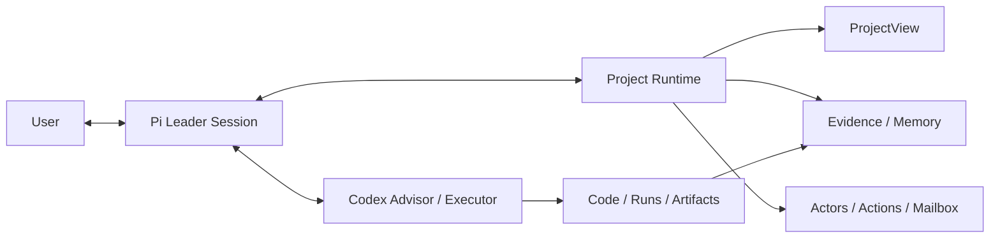

# Research Pi

> 面向Project设计的Research harness，拒绝一个session干到底。

Research Pi 是面向 AI、机器人、通信、优化与仿真等计算实验科研的 Pi Harness。它把代码视为检验假设的实验工具，优先追求可靠信息、有效证据和高信息增益实验；只有当研究方向得到支持后，才提高工程化与稳定交付强度。

它不是一段“科研提示词”，而是一套 Project-centric Runtime：长期研究状态、实验记录、Agent 协作、权限和 Session 交接不再完全依赖单次模型上下文。

`Pi Core 0.84.2` · `DeepSeek / OpenCode Go` · `Codex App Server` · `macOS / Linux / WSL2`

## 设计原则

1. **Project 不等于 Session**：Project 保存长期研究状态；Session 是可替换的临时工作集。
2. **Message、State、Context 分开管理**：事件、当前判断和某次模型调用所需内容不是同一件事。
3. **执行完成不等于科学结论成立**：命令、提交和 run 可以自动记录；证据是否有效仍需科研判断。
4. **Leader 与 Executor 分工**：Pi 负责研究规划、解释和用户沟通；Codex 负责工具密集或长程执行。
5. **默认高探索、强可逆、重证据**：先回答“想法是否成立”，再考虑把实现做得漂亮。



## 快速开始

要求 Node.js `>=22.19`。

```sh
npm install -g 'git+https://github.com/RosMarinas/Research-Pi.git#main'
pi setup
pi paths
```

根据 `pi paths` 给出的 `credentialsPath` 填写至少一个供应商密钥：

```dotenv
DEEPSEEK_API_KEY=...
OPENCODE_API_KEY=...
```

然后在科研项目中启动：

```sh
cd /path/to/research-project
pi
```

如果只想阅读结果、讨论和分析，而不允许当前 Session 改代码或启动实验：

```sh
pi --analysis
```

首次接入现有项目时，可以直接说：

```text
先只读恢复当前研究状态：识别研究目标、竞争假设、已有证据、失效路线和关键未决问题。
不要立即启动大实验；先说明 ProjectView 缺少什么，以及下一步最有信息量的动作。
```

## 核心能力

| 能力 | 作用 |
|---|---|
| Research Contract | 让 Agent 默认采用探索、证伪、有效性检查和证据驱动收敛 |
| Project Runtime | 维护 Project State、Actors、Actions、mailbox 与 Leader Session 所有权 |
| ProjectView | 将 structured state 与最新 evidence delta 追加到模型上下文，避免旧状态冒充当前结论 |
| Research Memory | 对历史 Session 和实验记录做本地全文检索，不依赖向量数据库 |
| Research Compaction | 在模型 settled 后生成带 provenance 的结构化状态，而不只摘要聊天文本 |
| Experiment Records | 用 `record_experiment` 区分观察、有效性和解释；支持换轨与窄幅状态修订 |
| Codex Collaboration | 以可续接 mission 调用 advisor/executor，并通过 Runtime mailbox 与 Pi 通信 |
| Project Boundary | 默认把模型命令限制在当前项目；SSH、外部文件和宿主命令通过显式 capability 授权 |
| Research Briefing | 在重大结果或阶段交接时恢复工作脉络，并把内部术语翻译成用户可判断的报告 |

ProjectView 使用 append-only snapshot/delta：研究 revision 或 Git identity 改变时，下一用户轮只在 Session 尾部追加更新；同一轮中新产生的 evidence 由 `context` hook 临时补到下一次模型调用尾部。旧 ProjectView 不会反复删除和搬位，因此更利于 DeepSeek 等 provider 复用共同前缀，同时避免陈旧 compact 污染当前判断。

## 常用入口

| 命令 | 用途 |
|---|---|
| `/runtime` | 查看 ProjectView、Actors、Actions、mailbox 和 Session 状态 |
| `/runtime rotate` | 新建不复制旧 transcript、但继承 Project 状态的 Leader Session |
| `pi --analysis` | 新开只读 Analysis Session；不抢占 Leader，不接收其 mailbox |
| `/analysis send <摘要>` | 把有价值的讨论投递给 Leader；用 `/runtime promote <原因>` 转为 Leader |
| `/runtime context <on\|off>` | Analysis 保持只读角色，只切换后续轮次是否注入 ProjectView |
| `/runtime new clean` | 新建不继承 ProjectView 的纯净 Session；用 `/runtime inherit` 恢复 |
| `/memory <query>` | 搜索当前 Project 的历史 Session 与实验记录 |
| `/side <问题>` | 隔离追问；有价值时用 `/side use <id>` 提升到主线 |
| `/watch` | 观察 Codex 的命令、文件修改和 subagent 活动，不污染 Leader 上下文 |
| `/actors`、`/inbox` | 查看活跃 Actor 和待处理 Runtime 消息 |
| `/model` | 切换并持久化 Leader Session 模型 |
| `/config` | 查看统一配置和切换主题 |
| `/boundary doctor` | 检查项目、Git、Python、sandbox 与 Codex 环境 |

模型可直接调用的研究工具包括 `record_experiment`、`record_research_transition`、`amend_project_state`、`research_checkpoint`、`research_memory_search/read`、`codex_delegate` 和 `host_capability`。

## 安全与数据

- 模型 shell 默认可读写当前项目和正常 Git 数据；其他项目、宿主凭据和 Unix socket 不自动开放。
- SSH target、项目外只读文件和宿主命令需要一次、当前 Session 或当前 Project 范围的明确批准。
- 私钥、`.env`、API key、keychain 和云凭据不能进入模型上下文。
- 配置、Session、Runtime、Codex job、授权账本和 trace 位于用户状态目录，不进入科研仓库。
- `pi-traced` 可能记录完整 prompt 与工具内容，只应短时诊断；默认 trace 和 Codex DEBUG SQLite 日志均关闭。

## 配置与目录

```text
~/.config/research-pi/        config.json、schema、credentials.env
~/.local/state/research-pi/   sessions、Runtime、memory、Codex、grants、trace
<research-project>/.pi/       项目实验记录与 checkpoint
```

实际路径以 `pi paths` 为准。常用配置命令：

```sh
pi config show
pi config list
pi config use opencode-go-flash
pi --profile deepseek-pro
```

Research Pi 关闭全局 skill/extension 自动发现，只显式加载审查过的 Harness 扩展、内置 `research-briefing` 和配置白名单。

## 开发与验证

```sh
git clone git@github.com:RosMarinas/Research-Pi.git
cd Research-Pi
npm install --ignore-scripts
cp .env.example .env
./install-user.sh

npm run check
npm test
npm run test:package
```

- `pi`：运行 Research Pi Harness。
- `pi-raw`：运行锁定的原始 Pi Core，便于行为对照。
- `pi-traced`：临时启用敏感 trace。
- `./run-pi.sh --workspace /path/to/project`：从源码 checkout 直接运行。

## 文档

- [基本使用指南](docs/pi-basic-guide.md)
- [统一配置说明](docs/configuration.md)
- [Project Runtime 测试与恢复](docs/research-runtime-test-guide.md)
- [安全模型与本地数据](docs/security-model.md)
- [设计思想与阶段成果汇报](thesis/ResearchPi.pdf)

当前版本是可日常使用的 Research Runtime，不是全自动 AI Scientist。它不会替用户冻结科研结论，也不会在缺少证据时自动选择研究路线。

## License

Research Pi 的原创代码与文档采用 [MIT License](LICENSE)。第三方组件保留各自许可证，详见 [Third-Party Notices](THIRD_PARTY_NOTICES.md)。
