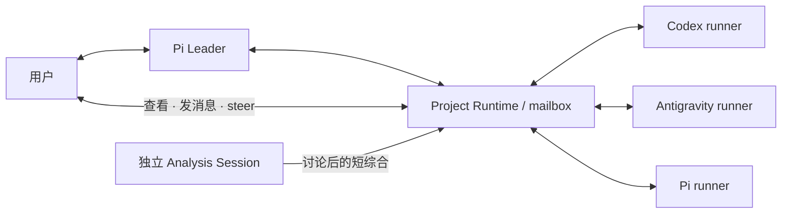

# Research Pi

简体中文 · [English](README_en.md)

> Session is not enough for research. Project is.

面向 AI、机器人、通信、优化与仿真的科研 Agent Harness，基于 **Pi Core 1.0.0**，支持 macOS、Linux 与 WSL2。

Research Pi 把研究目标、实验记录、关键决定和多 Agent 协作留在项目中。Session 可以轮换，模型可以更换，研究主线不必从头解释。它关注的不只是“代码是否正确”，还包括：实验是否检验了预期假设、证据允许什么结论、下一步做什么最有信息量。

## 统一 subagent，不统一掉各自的能力

Leader 通过一个 `subagent` 入口调度工作；Runtime 统一记录 Actor、任务、状态和消息。**Role 是分工，backend 是接入方式，model 与 thinking 是执行配置。** 用户可以设置默认值，Leader 也可以按任务选择。

| 角色 | 默认 backend | 主要工作 |
|---|---|---|
| Pi Leader | Pi 原生 provider | 把握研究主线、组织证据、委派与整合结果 |
| advisor | Codex | 设计、架构、竞争解释、只读审查 |
| executor | Codex | 开发、实验执行、测试与验证 |
| environment | Antigravity | 依赖、SDK、工具链与环境配置 |
| general | Pi | 使用任意已接入 Pi 的模型完成独立任务 |

这些是注入 Leader 提示词的调用倾向，不是四套独立工具或强制路由。Pi runner 复用 Leader 的模型目录与认证，支持单独配置模型和思考强度，不局限于 OpenCode Go。Codex 保持原生 Web Search 默认开启；可选的 DeepSeek 搜索不是使用 Research Pi 的前提。


```mermaid
flowchart LR
    U[用户] <--> L[Pi Leader]
    L <--> R[Project Runtime / mailbox]
    U <-->|查看 · 发消息 · steer| R
    R <--> C[Codex runner]
    R <--> A[Antigravity runner]
    R <--> P[Pi runner]
    D[独立 Analysis Session] -->|讨论后的短综合| R
```

每个 subagent 的界面都显示 **backend · role · model · thinking**；继承配置时会标示 `inherit`。用户不必经过 Leader，就能查看其行为和发送指令。切换 runner 时用普通任务与上下文消息接续，不额外生成 handoff 文件。

## 快速开始

要求 Node.js `>=22.19` 与 Git。Windows 请在 WSL2 内安装和运行，并将项目放在 WSL 文件系统中，而不是 `/mnt/c` 等 Windows 挂载盘。

```sh
npm install -g 'git+https://github.com/RosMarinas/Research-Pi.git#main'
pi setup

cd /path/to/research-project
pi
```

进入 Pi 后，用 `/login` 登录供应商，再用 `/model` 选择 Leader 模型。模型目录、订阅认证与自定义模型由 Pi 原生管理，Research Pi 不维护第二套 provider 目录。

按需准备 subagent backend，不必全部安装：

| Backend | 准备方式 | 认证与模型来源 |
|---|---|---|
| Pi | 在 Pi 内完成 `/login` | 与 Leader 共用 Pi provider 目录和认证 |
| Codex | 安装 Codex CLI，运行 `codex login` | 独立的 Codex CLI 登录与模型目录 |
| Antigravity | 安装提供 `agy` 命令的 CLI，首次交互运行 `agy` 登录 | 本机 Antigravity 登录与模型目录 |

Pi 的 `/login` 不会登录 Codex CLI，也无需复制 OAuth token。API-key 供应商的可选凭据文件和实际目录用 `pi paths` 查询；详见[配置说明](docs/configuration.md)。

首次接入现有项目，可以先说：

```text
先只读恢复当前研究状态：识别目标、竞争假设、已有证据、失败路线和关键未决问题。
不要立即启动大实验；先说明下一步最有信息量的动作。
```

### 配置模型与思考强度

从 `/config` 进入分级菜单：模型与角色 → Leader / Subagents / Codex 内部 agents → 角色 → backend、model、thinking。修改后留在当前菜单，`Esc` 返回上一级；`/models` 是模型菜单的快捷入口。候选来自各 backend 自身的目录，`/models show` 查看全部配置。

```text
/models
/models show
/models advisor thinking high
/models general backend pi
/models general thinking high
```

在面板中为任意角色选择 backend、model 和 thinking；Leader 也可在单次 `subagent` 调用中指定这些值。角色默认值的更改只影响新任务，不会偷偷改变正在运行的任务。Pi 原生 `/model`、`/settings`、`/scoped-models` 和 `/login` 仍可使用。

Codex worker 内部继续派生的 agents 属于它自己的调用树，可通过 `/models internal` 配置；它们不是额外的顶层 Runtime Actor。Codex Fast 等设置见[统一模型配置](docs/configuration.md#unified-model-settings)。

### 查看与直接控制 subagent

```text
/actors
/subagents
/watch @actor
/message notify @actor 请先汇报环境检查结果，暂不安装新依赖。
/steer @actor 优先验证 CPU 路径，暂缓 GPU 实验。
```

`/watch` 先选 Actor，再选「切换当前终端」或「新开终端」；也可以在另一 shell 执行 `pi watch --workspace /path/to/project`。界面复用 Pi 的对话渲染与输入框，顶部保留 **backend、角色、模型、思考强度和状态**，显示近期回复与工具活动，不把观察日志塞进 Leader 上下文。

监看界面输入消息会以 **User** 身份直接发给当前 subagent；支持 `/ask`、`/reply`、`/steer`，`Tab` 切换 agent，`PgUp/PgDn` 翻阅，空输入时 `Esc` 返回 Leader。独立窗口只是同一 Actor 的观察与消息入口，不另开模型、不接管 Leader。新终端自动打开失败时会给出可复制的命令。

Runtime 统一的是 **User、Leader、Analysis、Subagent 之间的消息与回执**；`start/status/wait/cancel/reconcile` 仍是工具调用，内部工具执行也不经过 mailbox。Codex 保留原生投递通道，Pi 在安全接收点处理消息，Antigravity 忙时消息留在 Runtime，当前轮结束后继续；投递不等于已执行。

### 连贯任务如何复用

Leader 判断上下文是否相关：同一 `mission` 默认继续，同一 Actor 可用 `jobId` 显式继续；独立工作换任务名或设 `reuse=never`。Runtime 为三个 backend 实施相同入口，不做语义分类或强制路由。继续时保留已有模型与思考强度，不受角色默认值后续修改影响；Pi/Antigravity 要换模型时新开上下文即可。

Codex 保留持久任务、同工作区并发、写入范围协调及恢复机制。Pi／Antigravity runner 使用独立长驻进程承接后续消息，**目前只在所属 Pi 进程存活期间可继续操作，退出时会关闭，重启后不自动恢复**。统一入口不代表三个 backend 的恢复和授权能力完全相同。

## 手机网页访问

保存一次偏好，以后正常运行 pi 就会自动开启私有网页，并连接该项目的同一个常驻 Pi：

    pi config web tailscale
    pi --workspace /path/to/project

关闭电脑终端后后台任务继续；Ctrl+] 可主动断开终端。pi web start 可仅在后台启动，pi web status 查看配对网址，pi web stop 停止服务。这三个命令也支持 --workspace。单次关闭网页可用 --no-web，非交互模型调用不自动开启网页。

手机连接当前 Tailscale 网络，打开终端提供的私有配对链接。对话、Agents、Project Runtime 使用手机界面；完整终端视图保留 /config、/watch、/login、会话树和自定义 TUI。电脑与手机共用同一个 Pi 进程，关闭网页不会停止任务。

复用平时的 pi 入口；源码开发版使用 run-pi.sh，以保留 .pi 中的登录与历史。恢复旧会话可加 --resume。直接 node bin/pi.mjs 默认读取另一套用户级数据目录，可能出现需要重新登录和历史为空。

仅本机试用可用 --web。服务只监听 localhost，要求令牌与同源请求；Tailscale 模式限定当前用户身份，保留已有 Serve 配置。正在运行且未启用 Web 的 Pi 需要等下一次计划启动再使用。[使用方式、功能范围与安全说明](docs/mobile-web.md)。

## 项目记忆，而非无限增长的聊天

- **ProjectView**：初始化与 compact 时建立固定项目快照。日常进展通过对话、工具结果和消息追加，不反复改写已发送的前缀。
- **实验账本**：用一条轻量记录保存问题、干预、观察、有效性和下一步；普通探针与成功命令不强制写文档，不复制原始证据。
- **本地检索与 compact**：按需找回历史 Session 和实验记录；压缩保留结构化研究状态与来源，而不只是聊天摘要。

长期项目可以维护一份短 `RESEARCH.md`，写清研究问题、最终目标、总体路线、非目标与判断原则。当前 run、每日 TODO 和流水账留给 Runtime 与实验记录。Anchor 在建立快照时读取，修改文件不会自动重写当前 Session 的上下文；急需生效的变化请在对话中说明。

`/runtime rotate` 新建 Leader Session，继承项目状态但不复制旧 transcript。`/runtime new clean` 创建不继承项目记忆的 Session，**不会删除项目记录**。

## 双 Session：主线继续，讨论独立

一个终端运行 `pi` 推进工作，另一个运行 `pi --analysis` 阅读结果、追问和讨论。


Analysis 读取同一项目的工作视图，但不抢占 Leader，不修改代码、启动实验或调度 subagent。长讨论保留在自己的 Session，只有值得主线知道的综合才投递：

```text
/analysis send 当前判断、关键依据、仍存不确定性与建议下一步
```

这是一条建议，不会自动成为科研证据。独立 Codex 讨论 Session 也可通过 `pi analysis context` / `pi analysis send` 使用同一通道。

## 常用入口

| 入口 | 用途 |
|---|---|
| `/runtime` | 查看 ProjectView、Actors、Actions、mailbox 与 Session 状态 |
| `/actors`、`/subagents`、`/watch` | 查看协作成员、任务与 backend 活动 |
| `/message`、`/steer` | 直接向 Actor 发消息或调整任务方向 |
| `/models`、`/config` | 配置模型分工与其他 Harness 设置 |
| `/memory <query>` | 搜索项目历史与实验记录 |
| `/side <问题>` | 隔离追问；用 `/side use <id>` 将有价值的结果引入主线 |
| `/runtime rotate` | 轮换 Leader Session，保留项目状态 |
| `pi --analysis`、`/analysis send` | 独立只读讨论，向 Leader 投递短综合 |
| `/boundary doctor` | 检查项目、Git、Python、sandbox 与 Codex 环境 |
| `pi paths` | 查看当前配置、认证目录和状态路径 |

## 权限与本地数据

Leader、Pi runner 与 Codex worker 使用相应的项目边界和角色权限；宿主命令、SSH 与项目外读取通过显式授权处理。Antigravity 使用自身的 CLI sandbox；非 advisor 任务在该 sandbox 内自动批准工具，advisor 使用 plan 模式，不能把它视为与 Pi 权限协议完全等价。

`pi --full-access` 为本次启动显式扩大 Leader／Codex executor 的权限；Analysis／advisor 仍只读。凭据不得进入模型上下文、日志或提交。仅加载受信扩展，因为扩展运行在宿主进程内。

默认安装路径如下；源码 checkout 使用独立的配置与状态，实际以 `pi paths` 为准：

```text
~/.config/research-pi/        config.json、schema、credentials.env
~/.local/state/research-pi/   sessions、Runtime、memory、subagents、grants、trace
<research-project>/.pi/       项目本地实验账本（自动从 Git 状态隐藏）
```

配置与认证不提交到科研仓库。Trace 默认关闭；`pi-traced` 可能记录完整 prompt 和工具内容，只用于短时诊断。完整说明见[安全模型](docs/security-model.md)。

## 升级与开发

已有安装重新执行上面的安装命令，然后**退出并重启旧 Pi 进程**；`/reload` 不会替换已加载的 Core。v1／v2 配置会迁移到统一 subagent 配置，旧 Session、实验记录和 Codex 任务无需删除。升级后用 `/models show` 检查角色配置。

从源码开发：

```sh
git clone https://github.com/RosMarinas/Research-Pi.git
cd Research-Pi
npm ci --ignore-scripts
./run-pi.sh --workspace /path/to/research-project

npm run check
npm test
npm run test:package
```

`pi-raw` 可运行锁定的原始 Pi Core 作行为对照。测试覆盖真实 Pi Core 集成和模拟 runner 协议，不调用付费模型；通过测试不代表当前账号拥有全部模型权限，也不代表科研任务质量已验证。

## 文档

- [基本使用指南](docs/pi-basic-guide.md)
- [配置、模型与并发执行](docs/configuration.md)
- [Pi 1.0 迁移与验证边界](docs/pi-1-migration.md)
- [Runtime 测试与恢复](docs/research-runtime-test-guide.md)
- [安全模型与本地数据](docs/security-model.md)
- [缓存诊断](docs/cache-diagnostics.md)
- [设计思想](thesis/ResearchPi.pdf)

## License

原创代码与文档采用 [MIT License](LICENSE)。第三方组件保留各自许可证，见 [Third-Party Notices](THIRD_PARTY_NOTICES.md)。

## 原生 TUI / Runtime 分离候选方案

独立 Host 保留完整 Pi InteractiveMode，桌面终端与 Web Gateway 可以分离退出。当前需显式启用 `pi --resident-runtime --web`，默认启动行为保持不变。[边界、使用与验收](docs/native-ui-runtime-boundary.md)。
