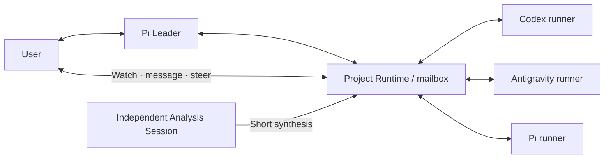
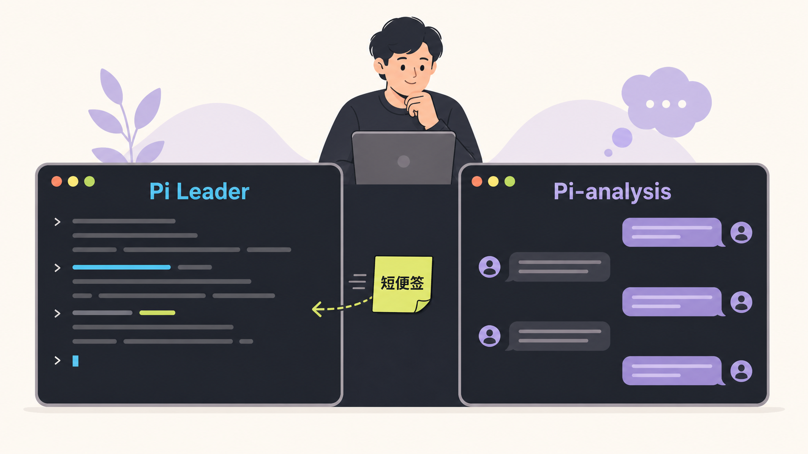

# Research Pi

[简体中文](README.md) · English

> Session is not enough for research. Project is.

A research-first agent harness for AI, robotics, communications, optimization, and simulation. Built on **Pi Core 1.0.0** for macOS, Linux, and WSL2.

Research Pi keeps research goals, experiment records, decisions, and multi-agent collaboration at the project level. Sessions and models can change without restarting the explanation. Beyond code correctness, it asks: did the experiment test the intended hypothesis, what conclusions does the evidence support, and what would teach us the most next?

## One subagent layer, distinct backend capabilities

The Leader delegates through one `subagent` tool. Runtime records actors, tasks, status, and messages. **Role describes the work; backend selects the integration; model and thinking configure execution.** Users set defaults, and the Leader can choose per task.

| Role | Default backend | Main responsibility |
|---|---|---|
| Pi Leader | Native Pi provider | Research direction, evidence interpretation, delegation, and integration |
| advisor | Codex | Design, architecture, competing explanations, and read-only review |
| executor | Codex | Implementation, experiments, tests, and verification |
| environment | Antigravity | Dependencies, SDKs, toolchains, and environment setup |
| general | Pi | Independent work using any model connected through Pi |

These preferences are injected into the Leader's instructions, not enforced as four separate tools or mandatory routes. Pi runners share the Leader's model catalog and authentication while allowing independent model and thinking settings; they are not restricted to OpenCode Go. Codex native Web Search stays enabled by default. Optional DeepSeek search is not a prerequisite.



Subagent views display **backend · role · model · thinking**, with inherited settings labelled `inherit`. Users can inspect workers and send instructions without going through the Leader. Switching runners uses an ordinary task/context message, not another handoff file.

## Quick start

Requires Node.js `>=22.19` and Git. On Windows, install and run inside WSL2. Keep projects in its Linux filesystem, not Windows mounts such as `/mnt/c`.

```sh
npm install -g 'git+https://github.com/RosMarinas/Research-Pi.git#main'
pi setup

cd /path/to/research-project
pi
```

Inside Pi, use `/login` to authenticate a provider and `/model` to select the Leader model. Pi owns model discovery, subscription authentication, and custom models; Research Pi does not maintain a second provider catalog.

Prepare only the subagent backends you want to use:

| Backend | Setup | Authentication and model source |
|---|---|---|
| Pi | Complete `/login` inside Pi | Shares the Leader's Pi provider catalog and authentication |
| Codex | Install Codex CLI and run `codex login` | Independent Codex CLI login and model catalog |
| Antigravity | Install the CLI providing `agy`; run `agy` interactively for initial sign-in | Local Antigravity login and model catalog |

Pi's `/login` does not authenticate Codex CLI; do not copy OAuth tokens. Use `pi paths` to locate the optional API-key credentials file and effective directories. See [configuration](docs/configuration.md).

For an existing research project, start with:

```text
First recover the research state read-only: identify the goal, competing hypotheses,
existing evidence, failed approaches, and key open questions.
Do not launch a large experiment yet; propose the most informative next action.
```

### Choose models and thinking levels

Start with `/config`: Models and roles → Leader / Subagents / Codex internal subagents → role → backend, model, thinking. Edits keep the menu open; Esc goes back one level. `/models` goes straight to model settings, and `/models show` displays the full configuration. Choices come from each backend's own catalog.

```text
/models
/models show
/models advisor thinking high
/models general backend pi
/models general thinking high
```

Choose backend, model, and thinking for each worker role in the panel. The Leader may override them for a single `subagent` call. Changes to role defaults affect new tasks, not tasks already running. Native Pi `/model`, `/settings`, `/scoped-models`, and `/login` remain available.

Agents spawned *inside* a Codex worker belong to its own call tree. Configure them with `/models internal`; they are not additional top-level Runtime Actors. See [unified model settings](docs/configuration.md#unified-model-settings) for Codex Fast and related controls.

### Observe and control subagents directly

```text
/actors
/subagents
/watch @actor
/message notify @actor Report the environment checks before installing new dependencies.
/steer @actor Validate the CPU path first; defer GPU experiments.
```

`/watch` selects an Actor and then offers **Switch in this terminal** or **Open a new terminal**. From another shell, run `pi watch --workspace /path/to/project`. The full-terminal view uses Pi's chat renderer and editor, with backend, role, model, thinking, and status in its header, plus recent responses and tool activity. Observation logs are not injected into the Leader's context.

Type directly as **User** to the selected subagent; `/ask`, `/reply`, and `/steer` are also available. Tab switches agents, PgUp/PgDn scroll, and Esc with an empty editor returns to the Leader. A separate viewer neither starts another model nor takes Leader ownership. If automatic terminal launch fails, it shows a copyable command.

Runtime unifies **messages and receipts between User, Leader, Analysis, and Subagents**, not lifecycle calls or internal tools. `start/status/wait/cancel/reconcile` remain APIs. Codex retains its native transport; Pi receives messages at a safe boundary; Antigravity messages remain in Runtime until its current turn settles. Delivery is not proof of execution.

### Reusing context across related work

The Leader decides whether context is useful: keep the same `mission` to continue, select an exact `jobId`, or choose another mission / `reuse=never` for independent work. Runtime implements this for every backend without semantic task classification or rigid routing. Continuations keep captured model/thinking settings even if role defaults change. Pi/Antigravity require a fresh context to change their model settings.

Codex retains durable jobs, same-workspace concurrency, write-scope coordination, and recovery. Pi and Antigravity runners keep independent processes for follow-up messages. **They are currently operable only while their owning Pi process is alive; shutdown closes them, and restart does not automatically recover them.** A unified entry point does not imply identical recovery or authorization capabilities.

## Project memory, not an ever-growing chat

- **ProjectView:** a fixed snapshot at initialization and compaction. Later progress enters through conversation, tool results, and messages instead of repeatedly rewriting the sent prefix.
- **Experiment ledger:** one lightweight record for the question, intervention, observations, validity, and next step. Ordinary probes and successful commands do not require documentation or copies of raw evidence.
- **Local search and compaction:** retrieve earlier sessions and experiments when needed; preserve structured research state and provenance rather than just a chat summary.

Long-running projects can maintain a short `RESEARCH.md` covering the research problem, final goal, overall approach, non-goals, and decision principles. Keep active runs, daily TODOs, and activity logs in Runtime and experiment records. The anchor is read when a snapshot is created; file edits do not rewrite an active Session's context. Communicate urgent changes in conversation.

`/runtime rotate` starts a new Leader Session with project state but no copied transcript. `/runtime new clean` creates a Session without inherited project memory; **it does not delete project records**.

## Two sessions: work continues, discussion stays separate

Run `pi` in one terminal to advance the research and `pi --analysis` in another to read results, ask questions, and discuss ideas.



Analysis reads the same project's work view without taking Leader ownership, modifying code, launching experiments, or scheduling subagents. Long discussions stay in their own Session. Send only the synthesis worth bringing to the main effort:

```text
/analysis send Current interpretation, key evidence, remaining uncertainty, and suggested next step
```

This is a proposal, not automatically research evidence. An independent Codex discussion session can use the same channel through `pi analysis context` / `pi analysis send`.

## Common entry points

| Entry point | Purpose |
|---|---|
| `/runtime` | ProjectView, Actors, Actions, mailbox, and Session status |
| `/actors`, `/subagents`, `/watch` | Collaboration members, tasks, and backend activity |
| `/message`, `/steer` | Direct Actor messages and task steering |
| `/models`, `/config` | Model assignments and other harness settings |
| `/memory <query>` | Search project history and experiment records |
| `/side <question>` | Isolated follow-up; promote useful results with `/side use <id>` |
| `/runtime rotate` | Rotate the Leader Session while keeping project state |
| `pi --analysis`, `/analysis send` | Independent read-only discussion and a short note to the Leader |
| `/boundary doctor` | Check project, Git, Python, sandbox, and Codex environment |
| `pi paths` | Find effective configuration, authentication directory, and state paths |

## Permissions and local data

The Leader, Pi runners, and Codex workers use their respective project boundaries and role permissions. Host commands, SSH, and external reads require explicit authorization. Antigravity uses its own CLI sandbox: non-advisor tasks auto-approve tools inside that sandbox, while advisors use plan mode. Its authorization protocol is not equivalent to Pi's.

`pi --full-access` explicitly expands Leader/Codex executor authority for that launch only; Analysis and advisors remain read-only. Credentials must stay out of model context, logs, and commits. Load only trusted extensions: they execute in the host process.

Default installed-package locations are below. Source checkouts have separate configuration and state; `pi paths` is authoritative.

```text
~/.config/research-pi/        config.json, schema, credentials.env
~/.local/state/research-pi/   sessions, Runtime, memory, subagents, grants, trace
<research-project>/.pi/       local experiment ledger (hidden from Git status automatically)
```

Configuration and authentication do not belong in research repositories. Trace is off by default. `pi-traced` may record full prompts and tool content; use it only for short diagnostics. See the [security model](docs/security-model.md).

## Upgrade and development

Re-run the installation command, then **exit and restart older Pi processes**. `/reload` does not replace an already loaded Core. v1/v2 settings migrate to the unified subagent configuration; existing sessions, experiment records, and Codex jobs do not need deleting. Check role settings with `/models show` afterward.

For source development:

```sh
git clone https://github.com/RosMarinas/Research-Pi.git
cd Research-Pi
npm ci --ignore-scripts
./run-pi.sh --workspace /path/to/research-project

npm run check
npm test
npm run test:package
```

Use `pi-raw` for comparison against the pinned, unmodified Pi Core. Tests exercise real Pi Core integration and synthetic runner protocols without paid model calls. Passing tests do not establish account access to every model or validate research quality.

## Documentation

- [Basic guide (Chinese)](docs/pi-basic-guide.md)
- [Configuration, models, and concurrent execution](docs/configuration.md)
- [Pi 1.0 migration and validation limits](docs/pi-1-migration.md)
- [Runtime testing and recovery](docs/research-runtime-test-guide.md)
- [Security model and local data](docs/security-model.md)
- [Cache diagnostics](docs/cache-diagnostics.md)
- [Design thesis](thesis/ResearchPi.pdf)

## License

Original code and documentation are [MIT licensed](LICENSE). Third-party components retain their own licenses; see [Third-Party Notices](THIRD_PARTY_NOTICES.md).
