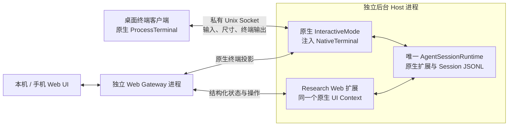

# 保留完整原生 TUI 的 Runtime 分离

状态：独立 worktree 的可运行候选方案，未替换 main 默认启动路径。基于固定 Pi 1.0.0。此前的简化 TUI 客户端与恢复外观补丁均不重新引入。

## 为什么此前的边界不成立

`InteractiveMode` 不只是渲染函数。它拥有原生输入/命令循环、补全、模型与设置菜单、会话树、编辑器、Extension UI 回调、Terminal input listeners、Footer、Widgets 以及 Session 替换后的重新绑定。`ctx.ui.custom()` 传递的是进程内 Component factory，`withSession` 传递的是新 Session 的回调能力。只投影消息并复用几个组件，不能保留这些功能。

Pi 1.0.0 的 `InteractiveModeOptions.terminal` 是已存在的注入点。本次保留完整 `InteractiveMode`，用 `NativeTerminal` 替代其物理 `ProcessTerminal`，而不是重写原生 TUI 或建立一个假 AgentSession。



**这里分离的是模块职责、物理客户端与 Gateway 的进程/生命周期；完整原生呈现控制器仍与 Runtime 同进程。** 为保留现有扩展，不能把这一版描述为“所有 UI 代码已在另一个进程中”。原生自定义渲染器自身的异常也尚未获得进程级隔离。原生终端投影目前共享一个视口；网页对话的布局独立，但多个终端镜像的尺寸不独立。

## 所有权与退出

- Host 唯一拥有模型、工具、Research Runtime、权限、Session 与原生呈现控制器。没有第二个浏览器 Agent 或第二个 Session writer。
- 桌面客户端仅处理真实终端。采用原生 `ProcessTerminal` 保留键盘协议、输入分帧与终端恢复；不是另一套 Editor 或快捷键实现。
- `Ctrl+]` 分离客户端；原生 `/quit` 和空输入时的退出行为被改为分离终端连接，Host 保留。
- `Ctrl+Z` 只挂起桌面客户端。原生默认会挂起进程组，不能把该行为直接用于后台 Host。
- 外部编辑器在桌面客户端调用原生 `editInExternalEditor`，完成后返回编辑内容。覆盖普通编辑框与原生 Extension Editor；Session 或草稿已变更时不覆盖新内容。
- `native-runtime stop` 显式停止 Host；`web stop` / `native-runtime web-stop` 只停止独立 Gateway。Gateway 重开时原生待处理审批仍在 Host。
- 启动发现同工作区的旧 tmux resident 或上一轮实验 Host 仍活跃时拒绝接管。不会自动杀进程或让两个 owner 管同一个工作区。

原生工具、菜单、`ctx.ui.custom()`、Widgets、Footer、command context 和 Session rebinding 直接由原来的 `InteractiveMode` 完成。Web 保留回滚版本的界面和协议；它可以通过终端投影使用完整命令，结构化审批仍使用现有同请求、首次回答有效的机制。所有 UI 操作均进入同一个原生 Runtime。

## 使用与隔离验收

默认 `pi` 和旧 tmux Web 路径保持原实现。候选方案必须显式启用；已有 Native Host 时普通 `pi` 会连接它。

```bash
# 显式使用后台 Host + 完整原生 TUI
pi --resident-runtime --web
# 手机访问仍用当前 Tailscale 登录身份
pi --resident-runtime --web-tailscale
# 只启动，不附加终端
pi native-runtime start --workspace /path/to/project --web
# 后台 Host，不开 Web
pi native-runtime start --workspace /path/to/project --no-web
# 附加、观察、关闭 Web、显式停止 Host
pi native-runtime attach --workspace /path/to/project
pi native-runtime status --workspace /path/to/project
pi native-runtime web-stop --workspace /path/to/project
pi native-runtime stop --workspace /path/to/project
# 重开 Web：复用同一个 Host
pi web start --workspace /path/to/project
```

Analysis 使用独立 Native Host（启动时 `--resident-runtime --analysis --no-web`；管理命令也带 `--analysis`）。此候选路径用于交互模式，不把 print/RPC 错误地当成后台 TUI。

当前开发验收建议先只使用离线项目：

```bash
node scripts/native-runtime-demo.mjs
node scripts/native-runtime-review.mjs tui
node scripts/native-runtime-review.mjs open
node scripts/native-runtime-review.mjs status
node scripts/native-runtime-review.mjs stop
```

`output/runtime-review/native-access.json` 为私有、Git 忽略的测试指针，不能提交或分享。离线项目提供 `/web-test-dialog` 和 `pi:web-demo` 消息回环，不调用付费模型；外部编辑器用写入合成文本的 Node 测试程序代替真实编辑器。

## 已验证与未验证

- 完整测试 262 项通过；新增 3 项检查原生 custom UI、模型菜单、审批断线保留、Session 替换与 `withSession` 草稿、原始消息循环、退出仅分离、物理终端动作路由。
- 真实 PTY：`/config` 原生菜单、`/watch pi:web-demo` 投递/回复回环、110×38 → 64×22 缩放、Ctrl+] 分离退出码 0，Host PID 不变。
- 真实物理客户端外部编辑器回传成功；后台 Host 未停止。
- Gateway 在审批等待时关闭/重开：Host PID、审批 ID、浏览器 cookie 保持；后续 confirm/select/input 可以继续回答。WebKit 确认浏览器配对与真实 Host 状态。
- syntax check 与 npm 打包检查通过。

本次不把“保留原生实现”当作所有插件的普遍验证：真实 OAuth、付费提供方、任意第三方扩展直接访问 process.stdin/stdout 或启动交互子进程的行为尚未实测。自定义 Component 经 ctx.ui.custom 的路径已验证；绕开 UI API 的第三方终端操作仍需适配。

依赖原生私有方法的生命周期与物理终端动作适配只针对当前固定版本。升级 Pi 时必须先运行上述功能回归，不能只检查界面截图。

本次没有重新加入多项目统一入口、新 Web 设计或全部呈现控制器的独立进程。这些应在此原生兼容接缝经实际验收后继续实现，避免同时改三个边界而再次丢失功能。

## Analysis handoff and compaction scheduling

An explicit `analysis_send_to_leader`, `/analysis send`, or CLI analysis handoff
now wakes the attached Leader at an idle boundary. It remains a proposal, not a
Project State update or new execution authorization. Ordinary `notify` messages
still attach silently to the next turn. Busy Leaders retain Analysis mail in the
durable mailbox until they can handle it.

Research threshold compaction reserves the settle boundary before scheduling the
native `ctx.compact()` call on the next event-loop tick. If another extension has
started a continuation or queued input, compaction waits for the next settle.
The reservation blocks Leader mailbox wakes and is released by native completion
or failure callbacks, rather than `session_compact`, which fires before Pi clears
its compaction state. Manual compaction still follows native Pi semantics; this
change does not automatically resume work deliberately interrupted by `/compact`.

Mailbox scans deferred during a run or compaction retry after the engine becomes
idle. Successful and failed compaction events also schedule a scan, so no new
user input or unrelated ledger write is required. Stopping or replacing a watcher
cancels its pending retry and fences in-flight scans from a newer Session.

Regression coverage includes Analysis wake versus ordinary notify, mail deferred
through successful and failed compaction, reservation cleanup, session shutdown,
and a real offline native SDK settle continuation followed by compaction. The
model-generated summary is replaced with a synthetic summary in the scheduling
test; paid provider behavior and historical interruption causes are not inferred
from this test.
