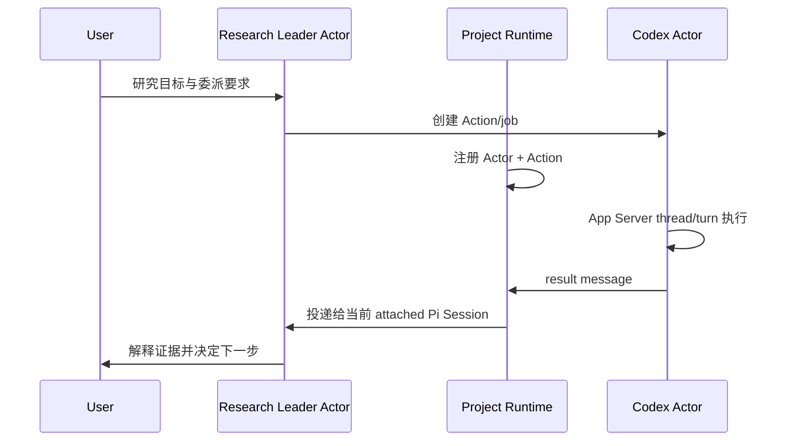

# Research Runtime：Codex 职责、状态与真实项目测试指南

状态：Milestone 2 已实测；下一阶段的多 Session 所有权、路线 provenance 与 ledger 恢复已实现，等待真实项目验证
更新：2026-08-20
适用版本：包含 `research-runtime.ts` 的 Research Pi 开发版

## 1. 先把几个对象分开

Codex 不属于某个 Pi 对话。它在 Project 中承担一个有界、可续接的子职责。

| 对象 | 含义 | 生命周期 |
|---|---|---|
| Project | 长期科研边界与 Runtime 状态所有者 | 跨 Session、跨模型长期存在 |
| Leader Actor | 项目中稳定的研究领导身份，当前由 Pi/DeepSeek 承载 | 身份稳定，可更换 Leader Session |
| Leader Session | 当前拥有执行、Project State 写入、Codex 调度和 Leader mailbox 的 Pi Session | 同一 Project 同时只有一个 |
| Analysis Session | 继承 ProjectView 的只读讨论入口；可查本地/远端证据，但不执行 | 可与 Leader Session 并存 |
| Codex Actor | 一个稳定的 Codex 子职责，当前由 `mission + mode` 定义 | 跨 Pi Session 存在，可反复激活 |
| Action/job | Codex Actor 接受的一次具体委派或续接 | 有明确开始与终态 |
| Activation | 正在运行的 worker、Codex App Server、thread/turn | 仅在 Action 运行期间存活 |
| Codex thread | Codex Actor 的 Provider 侧连续上下文 | Action 结束后仍可恢复 |
| Pi Session | Research Leader 的一次临时工作记忆和 UI 入口 | 可关闭、污染、compact 或替换 |

因此：

```text
Project
├── Leader Actor
│   └── 当前 attached Leader Session
├── Analysis Session 1..N (read-only, no Leader mailbox)
└── Codex Actor: mission + mode
    ├── stable Codex thread
    ├── Action/job 1 -> completed
    └── Action/job 2 -> running
```

“跨 Session 续接”不是把 Session A 的完整对话交给 Session B，也不是让 Session B 拥有 Session A。它表示 Session B 成为 Leader Session、attach 到同一个 Leader Actor 后，可以依据 Project Runtime 状态继续管理原 Codex Actor 和 thread。Analysis Session 只读取同一 ProjectView，不发生这次 attachment 转移。

Analysis Session 的最小流程是：从另一终端运行 `pi --analysis` 进入讨论；用只读工具或受限 SSH 核查结果；用 `/analysis send <message>` 将候选综合写入 Leader mailbox；只有用户执行 `/runtime promote <reason>` 后才取得执行权。analysis compact 保持 session-local，handoff 只是 proposal，不自动写入 Project State 或 Evidence。

## 2. Codex 在 Project 内负责什么

Codex Actor 是执行器或协作顾问，不是科研 Leader：

- `executor`：完成有界实现、诊断、实验执行或其他工具密集任务；
- `advisor`：围绕尚未成熟的问题进行只读协作，澄清共同理解、提出聚焦问题、展开候选解释并逐步形成 working synthesis；默认不充当反方评审；
- advisor 可以在答案会明显改善讨论时向 Research Leader 提出高价值问题，不必等到完全阻塞；executor 仍只在真正阻塞时提问；
- 可以接收纠偏、补充证据和回复；
- executor 必须返回操作结果、证据、局限与未解决事项；advisor 返回共同理解、候选解释、未决问题、证据、不确定性与建议的下一轮交流；
- 不自动决定研究目标，不因 Action completed 就更新科学结论。

同一 mission 的 advisor 与 executor 是两个 Actor，避免同时存在时 `/steer` 路由到错误 Activation。

Codex Action 仍被绑定到启动时的**精确 workspace**。同一 Git repository 的另一 worktree 可以共享 Project 身份，但不能管理或恢复该 Action，因为它代表不同文件状态和副作用边界。

## 3. 当前有哪些状态

### 3.1 Codex Actor 状态

Actor 本身不会因为一个 job 完成就“completed”。它是可再次激活的长期身份。

| 显示状态 | 含义 |
|---|---|
| `registered` | Actor 已建立，但还没有可恢复的 thread |
| `active (starting/running)` | 有 Action 正在启动或运行 |
| `waiting for input` | Action 在同一 turn 内等待 Leader/用户回复 |
| `suspended (completed)` | 最近 Action 完成，thread 可恢复 |
| `suspended (failed)` | 最近 Action 失败，但已有 thread 时仍可显式续接 |
| `suspended (cancelled)` | 最近 Action 被取消，Actor 身份和可用 thread 保留 |
| `suspended (outcome_unknown)` | executor 可能已产生副作用，必须检查外部状态并显式 reconcile |

`/actors` 的 active/waiting/suspended 来自 Actor 最新 Action，而不是 Pi Session attachment。只有 Research Leader Actor 才显示 attached/detached Pi Session。

### 3.2 Action/job 状态

当前沿用 Codex job 状态：

```text
starting -> running -> input_required -> running -> completed
                   \-> failed
                   \-> cancelling -> cancelled
                   \-> outcome_unknown -> reconcile -> completed|failed|cancelled
```

一次 suspended Actor 的新指令会通过原 thread 创建一个新 Action/job，而不是把旧终态 job 改回 running。

Job lifecycle 与叶子活动是两个维度。Runtime Dock 和 `/watch` 中的 `now:`/`last:` 只描述 command、file change、search 或 `research_pi_host` 调用；叶子活动的 `completed` 不得改变 Action/job lifecycle。只有持久 job state 自身进入 `completed` 且 `finishedAt` 已记录，才表示 executor 完成。

### 3.3 Runtime message 状态

```text
queued -> delivered -> consumed
                  \-> superseded
```

- `queued`：已耐久写入 Project mailbox，Provider 尚未接受；
- `delivered`：已交给目标 Adapter 或 attached Leader Session；
- `consumed`：已进入一次 Leader 模型运行并完全 settled；之后从模型上下文过滤；
- `superseded`：请求已被更新请求替代，或所属 Codex job 已进入终态；终态 ASK 会在投递前自动结算，避免跨 Session 反复出现。

投递采用 at-least-once 的恢复思路：如果进程在模型看到消息后、`agent_settled` 前崩溃，消息可能在恢复时再出现一次；不会为了追求 exactly-once 而增加高频事务写入。

状态折叠是单调的：`consumed`/`superseded` 不会被迟到的 `delivered` 回退；Action 的 `completed`/`failed`/`cancelled` 也不会重新变成 running。`outcome_unknown` 只能通过显式 reconcile 进入一个终态。

### 3.4 副作用恢复边界

executor 的 job 先记录 `intent_recorded`，在 App Server `turn/start` 前把 `started` 耐久落盘。若 worker 在 started 后消失或被强杀，恢复只能知道“副作用可能发生”，因此标为 `outcome_unknown`。Runtime 会阻止同一精确 workspace 的新 executor，避免重复提交、重复远程运行或在未知状态上继续写；advisor 不写项目，仍可用于检查。只有在检查 Git、文件、远程 run/job 等实际状态后，才可用 `codex_delegate action=reconcile` 提交 terminal outcome 与证据 note。Harness 不自动猜测。

## 4. 通信如何发生

### 4.1 正常委派和结果



完成只更新操作事实；Research Leader 仍需判断实验是否有效、证据是否支持假设。

### 4.2 Codex 主动提问

1. Codex 调用 `consult_research_pi` 或 App Server user-input request；
2. job 进入 `input_required`；
3. Runtime 创建 `ask` message，目标是 `research-leader`；
4. 当前 attached Pi Session 收到一次消息；
5. Leader 可用原 `codex_delegate respond`，用户可用 `/message reply @codex:<Actor短码> ...`；
6. Adapter 把 reply 映射到原 request ID；同一 Codex turn 继续执行。

回复不是启动另一只 Codex，也不需要把完整问题复制进新 Session。

Host capability 不走上述自由文本咨询路径。Codex 调用 `research_pi_host` 且没有匹配 grant 时：

1. 原 tool call 保持挂起，job 进入带 `kind=host_capability` 的 `input_required`；
2. attached Pi TUI 自动展示精确 cwd/target、完整操作和建议持久前缀；
3. 用户批准或拒绝；
4. Harness 自动把决定送回原 request ID，同一个 Codex turn 继续；
5. Runtime `ask` 在决定真正送回前保持 open，不能因为 Leader 已看到消息就提前 consumed。

如果没有 attached project-aware TUI，请求应耐久留在 inbox；恢复 TUI 后再弹窗。整个过程不要求 Leader 生成 grantId，也不应额外调用 `consult_research_pi`。

### 4.3 用户纠偏

```text
/steer @codex:<Actor短码> <修正>
```

- Actor active：映射为 Codex App Server `turn/steer`；不取消当前 Action；
- Actor suspended：恢复原 thread，创建一个新 Action；
- `--preempt` + active：取消当前 Action，再用同一 Actor/thread 创建新 Action；
- Research Leader：默认进入 Pi follow-up queue，当前工具批次完成后处理；
- 没有 Provider Adapter：消息保持 `queued`，不会假装已经送达。

`steer` 是瞬时纠偏。若内容应长期改变研究目标或约束，应另行更新 Project/Action 状态，而不是依赖旧 steer 永久留在上下文。

### 4.4 Pi Session 轮换

推荐从 Session A 执行 `/runtime rotate [reason]`，而不是把原生 `/new` 当成可审计交接：

1. Runtime 检查 Project State 可恢复、Project revision 已综合、没有 `outcome_unknown`，并确认未结 Action 有外部 job/run 身份；
2. 先写入 `session.rotation.requested`，记录源 Session、ProjectView fingerprint、未结 Action 和未消费消息 ID；
3. Pi 创建空白 Session B，只记录 parent Session provenance，不复制 A 的 transcript；
4. B attach 到同一个 Research Leader Actor，重新生成最新 ProjectView；
5. Runtime 写入 `session.rotation.completed` 和 B 的 ProjectView receipt；
6. queued 或已经 delivered 但尚未 consumed 的消息重投到 B；已 consumed 的消息不会重复注入；
7. B 可以继续管理原 Actor-owned job 或恢复 Codex thread。

用户仍可使用原生 `/new`。它同样会生成 ProjectView，但绕过 readiness 与 rotation request/completion 审计，因此不用于验证“Project 是否足以接管 Session”这一 Runtime 性质。Research Pi 永远不会自动执行轮换。

普通第二个 TUI 启动时不会静默抢走仍 attached 的 Leader。`/runtime`、`/runtime health|recommend|view`、`/actors` 和 `/inbox` 都是只读观察；一条真正的研究输入会在旧 Leader 没有 active agent run 时转移 attachment。若旧 Session 正在生成，输入会保留在编辑器并提示等待；只有 `/runtime takeover <reason>` 会显式越过该保护。claim 与 activation start 在同一个 ledger lock 中竞争，因此不会同时产生两个合法 owner。attachment epoch 变化后，旧 Session 在下一模型边界 abort；旧 shutdown 不能 detach 新 epoch，旧 settled run 不能消费消息，改变 Codex 状态的操作也必须持有当前 attachment lease。open message 会重投给新 owner。

这里没有把 A 的完整 transcript 注入 B。最近一次结构化 research compact 会提交带 Project revision 的 state；B 在模型调用前得到确定性的限长 ProjectView，优先合并 active transition、freshness、state provenance、project evidence 索引、Git 摘要、未结 Action 和 mailbox ID。它不包含完整旧 transcript，重要证据仍须通过引用或 memory read 精确读取。

方向切换不等待 compact。`record_research_transition` 立即使旧 state 变为 stale，并说明旧路线是 archived、superseded 还是 parallel；下一次 compact 才综合形成新 state。superseded/archived 时不会机械搬运旧假设，旧证据仍可检索；parallel 路线的存活状态会跨后续主路线切换保留，并可用精确 `fromTrackRef` 从任一 live route 继续。Evidence、Action、message、Project State 与 Codex job 都携带 track provenance；延迟返回的实验可显式保留旧 `trackRef`。ProjectView 根据 compacted state 自己的 track 判断它是否 retired，而不是只看最后一次 transition。Project revision 使用 compare-and-append：压缩或换轨基于旧 revision 时不会覆盖当前状态。ProjectView 观察 ledger semantic event count，但只在下一条真正的用户输入到来时捕获一份新的请求级 Delta；跨 Session 新增 Action/mailbox 不会单独唤醒 Leader 或改写正在运行请求的 Delta。

### 4.5 Clean Session 与 Project State 修订

`/runtime rotate` 是 project-aware 交接：新 Session 没有旧 transcript，但仍自动获得 ProjectView、未消费 mailbox 和可恢复 Actor。`/runtime new clean [reason]` 则是主动切断自动继承：新 Session 同时没有 transcript、ProjectView 和 mailbox 注入；clean 状态在 Session custom entry 与 Project Runtime request/receipt 两处可恢复。它不会删除磁盘上的 Project ledger，`/runtime` 和 `/runtime view` 仍可由用户只读检查；`/runtime inherit [reason]` 才从后续模型轮次恢复 project-aware 上下文。clean compact 只写 Session，不替换 Project State；恢复继承后的 compact 仍以 canonical Project State 为 prior state，clean summary 仅作为非权威候选综合。Codex `reuse=auto` 会降为新 thread，显式 job resume 仍需用户/Leader主动指定。

`amend_project_state` 解决的是另一件事：已有 structured Project State 只有少数字段需要纠正时，当前 attached Leader 可提交局部 patch。操作必须复制最新 Project revision，并提供 reason 与 authority refs；写入前在同一 ledger lease 中复查 attachment epoch 和 revision。它追加 `project.state.amended`，不改旧事件。省略字段保持，数组整体替换，`nextExperiment` 合并显式子字段。没有初始 state、目标 route 已 retired、clean Session、stale revision 或 stale attachment 都会拒绝。初始综合继续使用 `/compact`，实质换轨继续使用 `record_research_transition`。

## 5. 所有权与边界

新 Codex job 使用三层检查：

```text
projectKey + research-leader Actor    逻辑所有权，可跨 Pi Session
Leader session + attachment epoch     当前控制权；状态写入期间持有短 lease
exact workspaceKey/root               文件与副作用边界，不可跨 worktree
```

错误 Project、错误 Leader Actor 或另一 workspace 都会被拒绝。旧版本创建、没有 `leaderActorId` 的 job 不会自动迁移，仍只能由原 Pi Session/branch 管理。

## 6. 常用命令

```text
/actors
/inbox
/inbox all
/message ask @codex:<Actor短码> <问题>
/message reply @codex:<Actor短码> <回复>
/message notify @codex:<Actor短码> <新信息>
/steer @codex:<Actor短码> <纠偏>
/steer --preempt @codex:<Actor短码> <紧急纠偏>
/codex missions
/watch [job后缀|mission|@codex:<Actor短码>]
/runtime
/runtime health
/runtime recommend
/runtime view
/runtime takeover <reason>
/runtime rotate [reason]
/runtime new clean [reason]
/runtime inherit [reason]
```

Runtime mailbox 会保存消息正文，因此不要在这些命令中输入 API key、私钥或其他凭据。

`/runtime` 默认打开只读 Project Board。四个分页分别显示研究/记忆概览、稳定 Actor 与最新 Action、未消费 mailbox、当前 Leader attachment 与显式 handoff。面板只在打开和按 `r` 时读取既有投影，不写 heartbeat、不把展示内容加入模型上下文，也不把 Research Leader 从另一 Session attach 回当前窗口；持续执行细节仍由 `/watch` 展示。

## 7. 自动测试

### Layer 1：无模型 Runtime 测试

```sh
node --test tests/research-runtime.test.mjs tests/runtime-board.test.mjs
```

覆盖：

- Project 内稳定 user/Research Leader Actor；
- Session B attachment 替代 A，A 随后 detach（包括同 sessionId 的旧 epoch）不会误删 B；
- read-only Board/health/view/actors/inbox 不会抢 attachment；active Leader 阻止隐式接管，显式 takeover 产生新 epoch；
- message queued/delivered/consumed；
- message/Action 终态不被迟到事件回退，部分 JSONL 尾记录可恢复而中部损坏仍报错；
- mission 规范化与 advisor/executor Actor 隔离；
- Codex ask/result 的幂等投影；
- default steer 不 abort；
- `--preempt` 才 abort；
- consumed transient message 不再进入后续 context。
- rotation readiness 会阻止缺失/陈旧 Project State、`outcome_unknown` 和无外部身份的 active Action；
- rotation request/completion 可从 Project ledger 重建；
- clean Session request/receipt 可重建；启动、context、compact 与 Codex 自动复用都保持隔离，显式 inherit 后才投递 mailbox/ProjectView；
- delivered 但尚未 consumed 的 Leader 消息可在新 Session 重投，旧 epoch 的 settled run 不能抢先 consume。
- 另一 Session 的 transition、Action 或 mailbox 在下一条真正的用户输入中刷新请求级 ProjectView Delta，不会单独触发 Leader。
- Runtime Board 不重新激活 superseded claim，只展示为 prior claim；active Actor 优先、settled mailbox 被过滤，四个分页都适配 24 行终端的 92% overlay；没有按 `r` 时不会轮询。
- 从旧 Session 打开 Board 不会抢占当前 attached Research Leader，即使 cwd 经过 macOS `/var` 等规范路径别名。

### Layer 2：Fake Codex App Server

```sh
node --test tests/codex-jobs.test.mjs
```

覆盖：

- Session B 以同一 Project/Leader Actor 读取并续接 A 的 job；
- 只有同 workspace/mission/mode/track 自动复用；显式跨 track resume 带 route-change 警告；
- 已失去 Leader attachment 的 Session 不能启动新的 Codex Action；
- thread ID 保持，新的 Action 记录新的 job ID；
- 另一 workspace 和错误 Leader Actor 被拒绝；
- active Actor 接收跨 Session steer/cancel；
- 旧 branch-owned job 继续隔离；
- blocking request/reply、host capability、writer lease 和取消；
- 1000 个 token delta 不放大 job-state/默认 audit 写入。
- executor 在 durable side-effect barrier 后崩溃进入 `outcome_unknown`，阻止第二 writer，显式 reconcile 后恢复；
- compaction project state 的幂等提交、active-branch session migration 和 ProjectView 插入位置；
- Project State amendment 的局部保留、authority provenance、revision CAS、Leader lease、retired-route 与 clean-Session 拒绝；下一次 compact 使用较新的 Runtime state 作为 prior state；
- transition/evidence 使旧 state stale、superseding transition 停止旧假设回流，以及陈旧 compact 不覆盖新 revision；
- 较新的 Runtime Action 在没有明确 transition 时只触发 unconfirmed 警告；
- lifecycle health 只观察/建议，不自动 compact、rotate 或 reconcile；只有显式 `/runtime rotate` 才创建新 Session。

当前自动测试使用 Fake App Server 和本地 ledger，不调用真实模型/API；实际科研判断质量仍需要在真实 Project 中持续测试。

## 8. Layer 3：真实科研项目手动测试

### 8.1 前置条件

1. 两个终端都进入**完全相同的项目路径**，不要一个在主 worktree、一个在实验 worktree；
2. 当前实现尚未发布稳定 npm 包时，使用本仓库开发入口：

```sh
/Users/polaris/Documents/Utils/Pi/run-pi.sh --workspace /absolute/path/to/research-project
```

如果 `pi` 是开发软链接，也可直接运行 `pi`。启动页的 Extensions 中必须看到 `research-runtime.ts`。

3. 使用 advisor/read-only 任务验证通信；不要用真实删除、远程提交或昂贵实验测试 Runtime 协议；
4. 选择一个唯一 mission，例如 `runtime-handoff-smoke-20260815-a`，避免复用旧测试 thread；
5. 不在 Runtime message 中放凭据。

### 8.2 A：建立 Actor 与后台 Action

在终端 A 启动 Pi：

```text
/actors
```

预期至少出现：

```text
@user · User · user · present
@research-leader · Research Leader · leader · attached <session suffix>
```

然后对 Pi 说：

```text
请用 Codex advisor、mission=runtime-handoff-smoke-20260815-a 做一次只读协议测试：
只检查项目 README 或一个很小的入口文件；在给出最终结论前，必须向 user 提一个会改变审查范围的二选一阻塞问题；收到回复后再完成。不要修改文件，不要运行实验。
```

记录返回的 `codex-...` job ID。运行：

```text
/actors
/codex missions
```

预期出现稳定的 `@codex:<Actor短码>`，状态为 active 或 waiting。该短码由 Actor ID 派生，后续新建 Action/job 时不变化；底部 Codex 状态栏显示的仍是当前 job 后八位，不要混淆两者。

### 8.3 B：验证 active steer 不重开 Action

在终端 A、Codex 仍 active 时：

```text
/steer @codex:<Actor短码> 这是通信协议测试；请保持只读，并在结论中区分观察与推断。
```

通过标准：

- UI 显示 delivered；
- 原 job 不变成 cancelled；
- 没有新 job ID；
- Codex 最终结果体现该纠偏。

如果任务结束太快，跳过本步，不要为了制造并发而启动昂贵工作。

### 8.4 C：验证 Session B 接管 mailbox

Codex 尚未发出阻塞问题时，立即在终端 B 用同一 workspace 启动 Pi。运行：

```text
/actors
```

此时 B 只是观察者，Research Leader 应仍 attached 到 A。然后显式执行：

```text
/runtime takeover mailbox handoff smoke from terminal A to B
```

终端 B 的 Research Leader attachment epoch 应改变并指向 B；若 A 正在生成，它应在下一模型边界停止。随后阻塞问题应以 Runtime ask 卡片到达 B。若问题已经先在 A 被消费，使用新的唯一 mission 重做一次；不要把已消费消息的“不重复投递”误判为失败。

在 B 回复：

```text
/message reply @codex:<Actor短码> 选择第一项；因为本次只验证跨 Session 通信，不扩大审查范围。
```

通过标准：

- reply 映射到原 blocking request；
- Codex 在同一 job/turn 继续，而不是创建另一 Actor；
- 结果送到 B；
- `/inbox all` 中 ask/reply/result 具有合理的 delivered/consumed 状态；
- A 不会同时自动消费同一个终态 result。

### 8.5 D：验证 suspended Actor 恢复

Action 完成后，在当前 attached Session 输入：

```text
/steer @codex:<Actor短码> 在同一上下文中补充一句：本次协议测试没有验证哪些生产能力？
```

通过标准：

- 创建新的 job ID；
- Actor target 不变；
- Codex thread ID 延续；
- `/actors` 从 suspended 变 active，完成后再次 suspended；
- 旧 completed job 不被改回 running。

### 8.6 E：可选 preempt 测试

只在无副作用的 advisor Action 上测试：

```text
/steer --preempt @codex:<Actor短码> 立即停止当前审查；只总结已看到的协议事实，不再读取更多文件。
```

通过标准：若 interrupt 在可靠 turn 终态前完成，旧 Action cancelled，新 Action 使用同一 Actor/thread 继续；若 worker 被强杀且外部效果无法确认，应出现 `outcome_unknown`，不得自动重跑。真实测试只在你愿意检查并 reconcile 外部状态的任务上制造 crash。

### 8.7 F：验证 Runtime 管理的 Session 轮换

选择一个已经做过至少一次有效 research compact、ProjectView 能代表当前方向的真实任务。先运行：

```text
/runtime health
/runtime view
```

通过前置条件：health 显示 `Rotation: ready for /runtime rotate`；ProjectView 的 Project revision 与 compacted state revision 一致。`unconfirmed`（例如 Git 或可恢复 Action 较新）可以轮换，但 `missing`、`transitioning`、`stale`、memory lag 或 `outcome_unknown` 会阻止轮换。不要为了通过门槛伪造 compact；先让 Project State 真正表达当前研究方向。

执行：

```text
/runtime rotate handoff smoke after current research compact
```

预期：

- TUI 切到一个没有旧 transcript 的新 Session；
- 出现 rotation completed 与 ProjectView revision/freshness 提示；
- `/runtime view` 仍能看到相同 Project、当前研究方向、关键约束、evidence 索引和未结 Action；
- `/actors` 仍显示原 Codex Actor/Action，而不是创建副本；
- `/inbox all` 中已 consumed 消息不重现，delivered 但未 consumed 的消息可以重新投递；
- 在新 Session 提出下一条科研问题时，模型依据 ProjectView 接手，但需要精确证据时仍使用 memory read 或原 artifact，而不是把摘要当证据。

若 Pi 的 session replacement 被其他 extension 取消，rotation 会落为 `cancelled`，当前 Session 保持 attached。若切换过程中进程退出，request 仍留在 Project ledger；从原 Session 再次执行 `/runtime rotate` 会复用该 pending request，下一次成功的新 Session 会完成它。

### 8.8 G：验证 clean Session 与恢复继承

在一个 ProjectView 已包含容易辨认关键词、且 mailbox 至少有一条未消费消息的测试项目中执行：

```text
/runtime new clean test independent framing without project memory
```

通过标准：

- 新 TUI Session 不出现旧 transcript；Runtime Board sessions 页标为 `clean context`；
- 第一条普通问题的模型上下文不含 `<research_project_view>`，未消费 mailbox 不触发模型 turn；
- 对同一 mission 使用未显式指定的 `reuse=auto` 时开启新 Codex thread，而非续接旧 thread；
- clean Session 内 `/compact` 后，`/runtime view` 中 Project State revision 不变；
- `/runtime rotate` 明确拒绝并提示先 inherit，不会把 clean 与 project-aware 交接混用。

随后执行：

```text
/runtime inherit accept the current Project working state
```

下一条普通问题应重新获得 ProjectView，之前未消费 mailbox 被投递但不会凭空启动多个 turn；旧 transcript 仍不恢复。不要用敏感内容测试 mailbox。

### 8.9 H：验证窄幅 Project State 修订

先运行 `/runtime view` 记录当前 Project revision，选择一个不会改变研究路线的小字段，例如用户明确纠正 `currentClaim` 的适用范围或 `nextExperiment.question`。对 Pi 说：

```text
当前 ProjectView 的 currentClaim 把 pilot 写成了证明。请依据本轮用户决策，把它改成“pilot 只是筛选器，不是结论”；只修这个字段，不换轨，并调用 amend_project_state。
```

通过标准：

- 工具结果显示 Project revision 增加 1，ProjectView 显示 amendment reason 与 authority；
- 未提供的 hypotheses、decisions、critical context 保持不变；
- Runtime ledger 新增事件，旧 state 事件仍在；
- 用旧 revision 再发一次修订会被拒绝并要求刷新 ProjectView；
- 在 clean Session 中调用会提示先 `/runtime inherit`；
- 修订后下一次正常 compact 能把 amended state 作为 prior state，而不是把旧 Session compact 静默写回来。

## 9. 真实测试判定表

| 检查项 | 通过 | 失败信号 |
|---|---|---|
| Actor 稳定 | 新 Action 保持同一 `@codex` Actor | 每次续接都出现无关 Actor |
| Session 解耦 | B 能管理 A 创建的新 Actor-owned job | 提示 belongs to another Pi session |
| Leader 单写者 | 观察命令不抢占；active run 阻止隐式接管；显式 takeover 后旧 Session 停止 | 两个 Session 都能继续改变 Codex/模型状态 |
| Workspace 隔离 | 只有相同精确 workspace 可管理 | 另一 worktree 能接管 |
| ask/reply | 原 turn 在 reply 后继续 | 新建无关 delegation 或 request 丢失 |
| default steer | 原 Action 继续、无 cancel | 普通 steer 导致 cancelled |
| preempt | 旧 Action cancelled，新 Action 续接 thread | 旧 job 被改回 running 或 thread 丢失 |
| unknown outcome | 新 executor 被阻止；检查外部状态后 reconcile | 自动当作 failed 并重复执行 |
| ProjectView | 新 Session 可见 compact provenance、有效性标签和未结 Action | 注入整段旧 transcript 或把 completed 当证据 |
| Runtime rotation | request/completed 有审计，新 Session 有相同 ProjectView revision，旧 transcript 不复制 | 无 readiness 仍切换、pending 消息丢失或 Action 身份改变 |
| Clean Session | 无 transcript/ProjectView/mailbox 自动注入；inherit 后恢复且旧 transcript 仍为空 | clean 启动即出现项目记忆、compact 改写 Project State 或自动续接旧 Codex mission |
| State amendment | revision/lease/authority 均校验，局部字段改变且旧事件保留 | stale revision 覆盖、retired route 被重写、未提供字段丢失 |
| 单次投递 | result 只由当前 attached Leader 消费 | A/B 同时触发相同 result turn |
| Context 清理 | consumed message 后续不再注入 | 每轮重复出现旧 steer/result |
| 科研边界 | completion 不自动宣称假设成立 | job success 被当成科学结论 |

## 10. 反馈模板

```text
Project path:
Research Pi commit/version:
Session A suffix:
Session B suffix:
Codex Actor target:
Mission/mode:
Job IDs and thread ID:

Passed:
-

Unexpected behavior:
- command/input:
- expected:
- observed:
- which session received it:

Was any message duplicated or lost:
Did any ordinary steer cancel an Action:
Did another workspace gain access:
Relevant /actors and /inbox all output:
```

不要附上 `.env`、凭据、完整敏感 prompt 或整个 Runtime ledger；截取与路由状态有关的最小片段即可。
