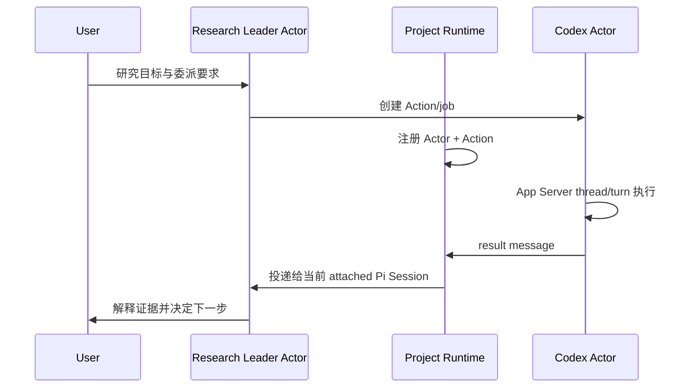

# Research Runtime：Codex 职责、状态与真实项目测试指南

状态：Milestone 1 implementation guide
更新：2026-08-15
适用版本：包含 `research-runtime.ts` 的 Research Pi 开发版

## 1. 先把几个对象分开

Codex 不属于某个 Pi 对话。它在 Project 中承担一个有界、可续接的子职责。

| 对象 | 含义 | 生命周期 |
|---|---|---|
| Project | 长期科研边界与 Runtime 状态所有者 | 跨 Session、跨模型长期存在 |
| Research Leader Actor | 项目负责人，当前由 Pi/DeepSeek 承载 | 身份稳定，可更换 Pi Session |
| Codex Actor | 一个稳定的 Codex 子职责，当前由 `mission + mode` 定义 | 跨 Pi Session 存在，可反复激活 |
| Action/job | Codex Actor 接受的一次具体委派或续接 | 有明确开始与终态 |
| Activation | 正在运行的 worker、Codex App Server、thread/turn | 仅在 Action 运行期间存活 |
| Codex thread | Codex Actor 的 Provider 侧连续上下文 | Action 结束后仍可恢复 |
| Pi Session | Research Leader 的一次临时工作记忆和 UI 入口 | 可关闭、污染、compact 或替换 |

因此：

```text
Project
├── Research Leader Actor
│   └── 当前 attached Pi Session
└── Codex Actor: mission + mode
    ├── stable Codex thread
    ├── Action/job 1 -> completed
    └── Action/job 2 -> running
```

“跨 Session 续接”不是把 Session A 的完整对话交给 Session B，也不是让 Session B 拥有 Session A。它表示 Session B attach 到同一个 Research Leader Actor 后，可以依据 Project Runtime 状态继续管理原 Codex Actor 和 thread。

## 2. Codex 在 Project 内负责什么

Codex Actor 是执行器或独立顾问，不是科研 Leader：

- `executor`：完成有界实现、诊断、实验执行或其他工具密集任务；
- `advisor`：只读审查、提出第二意见或挑战方案；
- 可以在任务中向 Research Leader 或用户提出一个真正阻塞的问题；
- 可以接收纠偏、补充证据和回复；
- 必须返回操作结果、证据、局限与未解决事项；
- 不自动决定研究目标，不因 Action completed 就更新科学结论。

同一 mission 的 advisor 与 executor 是两个 Actor，避免同时存在时 `/steer` 路由到错误 Activation。

Codex Action 仍被绑定到启动时的**精确 workspace**。同一 Git repository 的另一 worktree 可以共享 Project 身份，但不能管理或恢复该 Action，因为它代表不同文件状态和副作用边界。

## 3. 当前有哪些状态

### 3.1 Codex Actor 状态

Actor 本身不会因为一个 job 完成就“completed”。它是可再次激活的长期身份。

| 显示状态 | 含义 |
|---|---|
| `registered` | Actor 已建立，但还没有可恢复的 thread |
| `active (starting/running)` | 有 Action 正在启动或运行 |
| `waiting for input` | Action 在同一 turn 内等待 Leader/用户回复 |
| `suspended (completed)` | 最近 Action 完成，thread 可恢复 |
| `suspended (failed)` | 最近 Action 失败，但已有 thread 时仍可显式续接 |
| `suspended (cancelled)` | 最近 Action 被取消，Actor 身份和可用 thread 保留 |

`/actors` 的 active/waiting/suspended 来自 Actor 最新 Action，而不是 Pi Session attachment。只有 Research Leader Actor 才显示 attached/detached Pi Session。

### 3.2 Action/job 状态

当前沿用 Codex job 状态：

```text
starting -> running -> input_required -> running -> completed
                   \-> failed
                   \-> cancelling -> cancelled
```

一次 suspended Actor 的新指令会通过原 thread 创建一个新 Action/job，而不是把旧终态 job 改回 running。

### 3.3 Runtime message 状态

```text
queued -> delivered -> consumed
                  \-> superseded
```

- `queued`：已耐久写入 Project mailbox，Provider 尚未接受；
- `delivered`：已交给目标 Adapter 或 attached Leader Session；
- `consumed`：已进入一次 Leader 模型运行并完全 settled；之后从模型上下文过滤；
- `superseded`：被明确的新控制消息替代；第一阶段已经支持状态，但 UI 尚未提供专用替换命令。

投递采用 at-least-once 的恢复思路：如果进程在模型看到消息后、`agent_settled` 前崩溃，消息可能在恢复时再出现一次；不会为了追求 exactly-once 而增加高频事务写入。

### 3.4 当前尚未实现的状态

设计中的 `outcome_unknown` 尚未接入 Runtime。当前 Codex worker 异常消失仍由既有 job reconciliation 标记为 `failed`。因此第一阶段不能声称已经解决“外部副作用已发生但终态没有落盘”的自动恢复；真实项目测试不要用带非幂等外部副作用的任务验证 crash recovery。

## 4. 通信如何发生

### 4.1 正常委派和结果



完成只更新操作事实；Research Leader 仍需判断实验是否有效、证据是否支持假设。

### 4.2 Codex 主动提问

1. Codex 调用 `consult_research_pi` 或 App Server user-input request；
2. job 进入 `input_required`；
3. Runtime 创建 `ask` message，目标是 `research-leader`；
4. 当前 attached Pi Session 收到一次消息；
5. Leader 可用原 `codex_delegate respond`，用户可用 `/message reply @codex:<Actor短码> ...`；
6. Adapter 把 reply 映射到原 request ID；同一 Codex turn 继续执行。

回复不是启动另一只 Codex，也不需要把完整问题复制进新 Session。

### 4.3 用户纠偏

```text
/steer @codex:<Actor短码> <修正>
```

- Actor active：映射为 Codex App Server `turn/steer`；不取消当前 Action；
- Actor suspended：恢复原 thread，创建一个新 Action；
- `--preempt` + active：取消当前 Action，再用同一 Actor/thread 创建新 Action；
- Research Leader：默认进入 Pi follow-up queue，当前工具批次完成后处理；
- 没有 Provider Adapter：消息保持 `queued`，不会假装已经送达。

`steer` 是瞬时纠偏。若内容应长期改变研究目标或约束，应另行更新 Project/Action 状态，而不是依赖旧 steer 永久留在上下文。

### 4.4 Pi Session 轮换

1. Session A 启动 Codex Action；
2. Session B 在同一精确 workspace 启动或收到用户输入；
3. Session B 成为 Research Leader Actor 的最新 attachment；
4. 新产生的 ask/result 投递给 B；A 的后台 monitor 即使观察到终态也不会消费；
5. B 可以管理 Actor-owned job 或恢复 thread；
6. 已 consumed 的消息不会因 A 再次获得 attachment 而重复注入。

这里没有把 A 的完整 transcript 注入 B。Milestone 1 只迁移 Actor、Action 和 mailbox；更完整的 ProjectView bootstrap 属于后续阶段。

## 5. 所有权与边界

新 Codex job 使用两层检查：

```text
projectKey + research-leader Actor    逻辑所有权，可跨 Pi Session
exact workspaceKey/root               文件与副作用边界，不可跨 worktree
```

错误 Project、错误 Leader Actor 或另一 workspace 都会被拒绝。旧版本创建、没有 `leaderActorId` 的 job 不会自动迁移，仍只能由原 Pi Session/branch 管理。

## 6. 常用命令

```text
/actors
/inbox
/inbox all
/message ask @codex:<Actor短码> <问题>
/message reply @codex:<Actor短码> <回复>
/message notify @codex:<Actor短码> <新信息>
/steer @codex:<Actor短码> <纠偏>
/steer --preempt @codex:<Actor短码> <紧急纠偏>
/codex missions
/watch [job后缀|mission|@codex:<Actor短码>]
```

Runtime mailbox 会保存消息正文，因此不要在这些命令中输入 API key、私钥或其他凭据。

## 7. 自动测试

### Layer 1：无模型 Runtime 测试

```sh
node --test tests/research-runtime.test.mjs
```

覆盖：

- Project 内稳定 user/Research Leader Actor；
- Session B attachment 替代 A，A 随后 detach 不会误删 B；
- message queued/delivered/consumed；
- mission 规范化与 advisor/executor Actor 隔离；
- Codex ask/result 的幂等投影；
- default steer 不 abort；
- `--preempt` 才 abort；
- consumed transient message 不再进入后续 context。

### Layer 2：Fake Codex App Server

```sh
node --test tests/codex-jobs.test.mjs
```

覆盖：

- Session B 以同一 Project/Leader Actor 读取并续接 A 的 job；
- thread ID 保持，新的 Action 记录新的 job ID；
- 另一 workspace 和错误 Leader Actor 被拒绝；
- active Actor 接收跨 Session steer/cancel；
- 旧 branch-owned job 继续隔离；
- blocking request/reply、host capability、writer lease 和取消；
- 1000 个 token delta 不放大 job-state/默认 audit 写入。

2026-08-15 当前结果：两文件合计 18/18 通过，无真实模型/API 调用。

## 8. Layer 3：真实科研项目手动测试

### 8.1 前置条件

1. 两个终端都进入**完全相同的项目路径**，不要一个在主 worktree、一个在实验 worktree；
2. 当前实现尚未发布稳定 npm 包时，使用本仓库开发入口：

```sh
/Users/polaris/Documents/Utils/Pi/run-pi.sh --workspace /absolute/path/to/research-project
```

如果 `pi` 是开发软链接，也可直接运行 `pi`。启动页的 Extensions 中必须看到 `research-runtime.ts`。

3. 使用 advisor/read-only 任务验证通信；不要用真实删除、远程提交或昂贵实验测试 Runtime 协议；
4. 选择一个唯一 mission，例如 `runtime-handoff-smoke-20260815-a`，避免复用旧测试 thread；
5. 不在 Runtime message 中放凭据。

### 8.2 A：建立 Actor 与后台 Action

在终端 A 启动 Pi：

```text
/actors
```

预期至少出现：

```text
@user · User · user · present
@research-leader · Research Leader · leader · attached <session suffix>
```

然后对 Pi 说：

```text
请用 Codex advisor、mission=runtime-handoff-smoke-20260815-a 做一次只读协议测试：
只检查项目 README 或一个很小的入口文件；在给出最终结论前，必须向 user 提一个会改变审查范围的二选一阻塞问题；收到回复后再完成。不要修改文件，不要运行实验。
```

记录返回的 `codex-...` job ID。运行：

```text
/actors
/codex missions
```

预期出现稳定的 `@codex:<Actor短码>`，状态为 active 或 waiting。该短码由 Actor ID 派生，后续新建 Action/job 时不变化；底部 Codex 状态栏显示的仍是当前 job 后八位，不要混淆两者。

### 8.3 B：验证 active steer 不重开 Action

在终端 A、Codex 仍 active 时：

```text
/steer @codex:<Actor短码> 这是通信协议测试；请保持只读，并在结论中区分观察与推断。
```

通过标准：

- UI 显示 delivered；
- 原 job 不变成 cancelled；
- 没有新 job ID；
- Codex 最终结果体现该纠偏。

如果任务结束太快，跳过本步，不要为了制造并发而启动昂贵工作。

### 8.4 C：验证 Session B 接管 mailbox

Codex 尚未发出阻塞问题时，立即在终端 B 用同一 workspace 启动 Pi。运行：

```text
/actors
```

终端 B 的 Research Leader 应显示 attached 到 B。阻塞问题应以 Runtime ask 卡片到达 B。若问题已经先在 A 被消费，使用新的唯一 mission 重做一次；不要把已消费消息的“不重复投递”误判为失败。

在 B 回复：

```text
/message reply @codex:<Actor短码> 选择第一项；因为本次只验证跨 Session 通信，不扩大审查范围。
```

通过标准：

- reply 映射到原 blocking request；
- Codex 在同一 job/turn 继续，而不是创建另一 Actor；
- 结果送到 B；
- `/inbox all` 中 ask/reply/result 具有合理的 delivered/consumed 状态；
- A 不会同时自动消费同一个终态 result。

### 8.5 D：验证 suspended Actor 恢复

Action 完成后，在当前 attached Session 输入：

```text
/steer @codex:<Actor短码> 在同一上下文中补充一句：本次协议测试没有验证哪些生产能力？
```

通过标准：

- 创建新的 job ID；
- Actor target 不变；
- Codex thread ID 延续；
- `/actors` 从 suspended 变 active，完成后再次 suspended；
- 旧 completed job 不被改回 running。

### 8.6 E：可选 preempt 测试

只在无副作用的 advisor Action 上测试：

```text
/steer --preempt @codex:<Actor短码> 立即停止当前审查；只总结已看到的协议事实，不再读取更多文件。
```

通过标准：旧 Action cancelled，新 Action 使用同一 Actor/thread 继续。不要在真实远程实验、删除、提交或其他非幂等操作中做这个 smoke；当前 Runtime 尚无 `outcome_unknown` 恢复。

## 9. 真实测试判定表

| 检查项 | 通过 | 失败信号 |
|---|---|---|
| Actor 稳定 | 新 Action 保持同一 `@codex` Actor | 每次续接都出现无关 Actor |
| Session 解耦 | B 能管理 A 创建的新 Actor-owned job | 提示 belongs to another Pi session |
| Workspace 隔离 | 只有相同精确 workspace 可管理 | 另一 worktree 能接管 |
| ask/reply | 原 turn 在 reply 后继续 | 新建无关 delegation 或 request 丢失 |
| default steer | 原 Action 继续、无 cancel | 普通 steer 导致 cancelled |
| preempt | 旧 Action cancelled，新 Action 续接 thread | 旧 job 被改回 running 或 thread 丢失 |
| 单次投递 | result 只由当前 attached Leader 消费 | A/B 同时触发相同 result turn |
| Context 清理 | consumed message 后续不再注入 | 每轮重复出现旧 steer/result |
| 科研边界 | completion 不自动宣称假设成立 | job success 被当成科学结论 |

## 10. 反馈模板

```text
Project path:
Research Pi commit/version:
Session A suffix:
Session B suffix:
Codex Actor target:
Mission/mode:
Job IDs and thread ID:

Passed:
-

Unexpected behavior:
- command/input:
- expected:
- observed:
- which session received it:

Was any message duplicated or lost:
Did any ordinary steer cancel an Action:
Did another workspace gain access:
Relevant /actors and /inbox all output:
```

不要附上 `.env`、凭据、完整敏感 prompt 或整个 Runtime ledger；截取与路由状态有关的最小片段即可。
