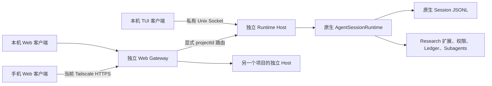

# UI 与 Runtime 分离：实现与验收

2026-10-06，开发分支 `codex/runtime-ui-separation`。当前保留在独立 worktree，用户验收后才合并、推送和删除 worktree。没有接管或重启主项目中正在使用的 Pi。

## 实际结构



Host 是模型循环、工具、权限、交互和会话的唯一拥有者。TUI 不加载第二个 AgentSession，Gateway 不拥有终端或模型。关闭所有界面、调整窗口、关闭或重启 Gateway 都不停止 Host。只有 `pi runtime stop` 或 Host 收到终止信号才结束运行时。

参考本机 DeepSeek Harness 的窄客户端契约、Host Session 投影、快照重连和事件序号设计：`packages/client/runtime/src/client/contract/session.ts`、`packages/client/runtime/src/client/sessions/session.ts`、`packages/host/apiproxy/src/api/events.ts`。该实现中的 `since` 未实现，不能照搬成事件重放保证。本实现使用内存中的 256 条 / 2 MiB 有界事件环；游标过期、Host 重启或会话 epoch 改变时必须重取快照。原生 JSONL 保留会话历史，事件环不是第二份持久数据库。

## 使用

```bash
# 独立开启多项目总入口，无需先进入某个项目
pi harness start
pi harness status
# 只关闭总入口，所有项目 Host 保留
pi harness stop
# 设置本机网页偏好，然后在目标项目启动；再次运行会连接同一个 Host
pi config web local
pi
# 不开启网页
pi --no-web
# 只启动后台 Host 和网页
pi runtime start
# 后台 Host 不开网页
pi runtime start --no-web
# 查看访问链接（首次配对后浏览器保留会话 cookie）
pi web status
# 关闭网页服务；模型和工具仍在 Host 中运行
pi web stop
# 再次开启网页服务
pi web start
# 显式结束 Host
pi runtime stop
# Analysis 使用单独的 Host；不会复用 Leader 启动参数
pi --analysis
# 原生旧界面兼容路径
pi --legacy-ui
```

Gateway 现在是当前安装与 stateRoot 共享的多项目入口，不再每个项目开一个网页服务。`pi harness start` 默认监听本机配置端口；普通项目启动仍可自动选择空闲端口。网页只需配对一次，项目目录登记和启动通过入口完成；发现已有新版 Host 时直接连接。不同项目、Leader 与 Analysis 保持独立 Host、会话和权限。每个修改请求携带明确的 projectId、Session ID 和 epoch；切换项目不会停止后台任务，也不会把迟到响应写入另一项目。目录登记并不自动启动模型，启动须点项目的启动按钮。默认本机网页仅监听 loopback。手机端继续使用已有 Tailscale Serve 和当前登录身份；未开启 Funnel，未改动 tailnet 身份。工作区无关的持久配对 token 沿用已有实现，原始 token 和提供方凭据不会进入版本库。`--web-port`、`--web-tailscale` 等原有网页参数保持可用，具体参数见 [手机网页说明](mobile-web.md)。

启动选项只能用于创建 Host。已有 Host 上的模型和会话切换使用 `/model`、`/resume` 等操作；若要改变启动资源，应先保存并显式停止 Host。发现旧 tmux resident 时新 Host 会拒绝启动；先用旧路径继续使用，在空闲后再迁移，防止两个写入者同时管理会话。

TUI：`Ctrl+]` 分离，`Ctrl+C` 中止当前轮，`Ctrl+D` 退出客户端，`Ctrl+P` 模型选择，`Ctrl+O` 工具展开，`Ctrl+T` 思考块，`Alt+Enter` steer，`PgUp/PgDn` 历史翻页；Host 连接丢失后 `Ctrl+R` 重连。

本机网页有项目与会话侧栏、对话、Agents 和项目页；手机使用同一入口与窄屏布局。对话合并命令、通知、审批和工具操作，按原生 toolCallId 配对调用与结果，显示思考块、Shell 输出、文件操作和结构化 Subagent 卡片；Research 状态 dock 与用量、上下文、队列始终在工作台可见。命令按钮与补全直接使用原 Host 命令，独立操作页仅保留给旧终端兼容路径。原生 `/model /thinking /resume /new /clone /import /tree /fork /compact /login /logout /settings /session /name /export /copy /reload /trust` 由 Host 执行。Research 的 `/runtime /watch /config /models /side` 等命令沿用原扩展；`/queue` 查看队列，`/queue clear` 清空。技能和提示模板沿用 Pi 原生展开。

## 本次隔离验收

在 worktree 执行：

```bash
node scripts/runtime-demo.mjs         # 创建隔离工作区和离线合成 provider
node scripts/runtime-review.mjs open  # 私下读取配对链接并打开系统浏览器
node scripts/runtime-review.mjs tui   # 同一 Host 的 TUI
node scripts/runtime-review.mjs status
node scripts/runtime-review.mjs stop  # 只关闭本次隔离验收服务
```

`output/runtime-review/access.json` 是权限为 0600 的本地私有指针，已被 Git 忽略。不要分享或提交它。验收 provider 不调用付费模型，31 个历史 Actor 和一个消息回环 Actor 是测试数据。

建议检查：

1. 在总入口切换两个离线项目，无需再次配对；各自的对话和会话应独立。在 Web 发消息，TUI 同时显示同一历史；关闭其中一个界面后另一个继续工作。
2. 在网页或 TUI 输入 `/web-test-dialog`，看到审批后关闭界面，再从另一界面回答同一个请求。
3. 使用 `/models`、`/config`、`/side collapse`、`/resume` 和 `/fork`；会话恢复显示已有内容，fork 将待编辑文字放回输入框。
4. Agents 页打开 `pi:web-demo`，发送文字，查看投递回执和“已通过 Runtime 收到”回复。历史长名称卡片可完整展开，不应互相覆盖。
5. 本机 1440 像素与手机 390 像素宽布局；手机键盘缩小视口后输入框与列表正常。
6. TUI 缩放和分离不影响 Host；网页重开后历史和待处理交互仍可恢复。

## 正确性边界与验证

Host 使用请求 ID 去重，Session ID 和 epoch 防止旧界面修改新分支；两个客户端回答同一审批只有第一次有效。交互保存在 Host，UI 断开不会默认允许或取消权限。普通输入在原生 preflight 确认为 started/queued/handled 后返回；交互式命令等待完成，不能与下一条输入并发越过。Actor 写入要求当前 Session 拥有 Leader，Analysis 不能通过网页绕过原有限制。

公开历史隐藏 system/developer 消息和内部上下文。历史分页只影响客户端显示，不截断模型上下文。离线请求捕获验证 UI 读取、视图和重连不会改变下一次请求已有消息前缀、系统提示或工具集合；这不保证提供方的服务端缓存命中或驻留时间。模型选择、压缩和原有 Research 业务逻辑仍由 Pi/扩展负责。

测试：`npm run check`、`npm run test:runtime`、`npm test` 和 `npm run test:package`；浏览器用 WebKit 检查桌面、手机和短视口，真实 PTY 检查 TUI 缩放、帮助和分离。模型调用和审批使用合成 provider；没有重新进行真实 OAuth 登录或付费模型请求。

UI 只上报是否有草稿的短期状态，用于保留既有“用户输入时暂缓自动接入 Leader”的行为；草稿正文不进入模型上下文或 Ledger。

第三方扩展任意 `ctx.ui.custom()`、自定义 Editor 或 Autocomplete factory 是进程内函数，不能直接穿过 Socket。新客户端会明确要求视图适配，不假装支持；本仓库 Runtime、Watch、模型和配置的必要视图已接入。旧界面仍可用 `--legacy-ui`。新 TUI 复用原生消息、Markdown、Editor、选择器以及 Watch/Runtime 面板，但不是原生 InteractiveMode 的逐像素复制。

请求去重与待处理交互在 Host 内存中，不提供 Host 崩溃后的 exactly-once 执行承诺。浏览器重连使用当前快照；Gateway 在 Host 不可达时标记状态未知、拒绝操作，重新连接后重取状态，不自动重发变更请求。原生历史 JSONL 和现有 Ledger 仍是持久事实来源。

### 本次实测结果

- 完整 `npm test`：277/277 通过，其中 Host 相关 16 项覆盖断线审批、去重、epoch、请求前缀、模板、草稿恢复和 Gateway 重连。
- `npm run check` 与 npm 打包验证通过。
- WebKit：桌面会话侧栏、新建后快速恢复历史、模型筛选；32 个长名称 Actor 无重叠；390×420 短视口输入区可见；Actor 消息投递回环成功；刷新后审批 ID 不变。
- 真实 PTY：帮助、模型选择、100×30 → 52×16 缩放和 Ctrl+] 分离成功；退出码 0，Host 保持可连接，无遗留审批。
- 隔离 CLI：关闭/重开 Gateway 保持 Host PID；单独启动无 Web 的 Analysis Host，原 Leader 保持，Actor 写操作被拒绝。

上述结果来自 macOS、固定 Pi 1.0.0 和离线合成 provider；没有把它当作真实提供方 OAuth、服务端缓存命中或所有第三方 UI 扩展的验证。

## 多项目工作台参考

[本次调研](pi-web-harness-research.md)对照了 DeepSeek Harness、本机官方 Pi 组件和社区 Pi Web UI。采用其项目/会话导航与结构化工具卡片思路，保留本项目固定的 Pi 1.0.0、Research 权限和唯一 Host 权威；没有引入第二个浏览器 Agent 或把提供方凭据移到浏览器。集中入口目前是本机同一用户的 Harness，不代表多人共享服务或已达到 Codex App 全部功能。

新增验证覆盖单次配对访问两个项目、显式路由、冷启动、会话隔离、跨项目旧 Session 拒绝、Gateway 关闭保留 Hosts，以及工具结果配对和参数转义。

WebKit 增量验收：审批在项目切换后保留原请求；另一个项目可独立发送消息。网页登记第三个目录并通过真实 CLI 冷启动 Host，未发送模型请求；停止该项目后另外两个 Host 保持运行，网页自动恢复启动按钮。1440×1000、390×844、390×420 布局检查通过；短视口输入框可见，无水平溢出。

## 暖黄色与白色视觉调整

视觉方案由 Antigravity 的 Claude Opus 4.6 负责，沿用同一 worktree。暖黄底色与白色内容区、深色正文替代主导绿色；字号、字距、行高与卡片留白按研究工作台的密度调整。手机输入保持 16px，保留短视口、触摸操作和长名称换行。调整仅涉及 Web 视觉，不改变 Runtime、审批、认证或项目路由。

WebKit 视觉复核：桌面正文 14px、手机正文 15px、输入 16px；桌面工具卡片高度约 231px → 189px，首个 Actor 卡片约 106px → 89px（同一离线数据）。手机项目选择器占满可用宽度，命令按钮高 40px。390×844 与 390×420 的对话/Watch 输入区在视口内，无水平溢出；32 个 Actor 卡片无重叠，系统深色偏好仍保持暖色浅底。打包检查通过。

## 原生 TUI 呈现回归修复

分离时的简化客户端错误地省略了原生 Footer、Research dock 和工具渲染器。本次注册原有 Research 主题，使用原生 Footer/ToolExecution/Assistant/User/Editor 组件，并让原生扩展与远程 TUI 共用同一 Subagent renderCall/renderResult。Research dock 复用原组件，恢复底部布局、thinking 输入边框和原生工具快捷键。无需关闭或重启 Host：Ctrl+] 分离当前客户端后重新运行 pi 即可加载新的客户端。

验证：280 项测试通过；真实 PTY 110×38 → 64×22 缩放、Ctrl+] 分离退出码 0，Host 仍可连接；工具卡片、Research dock、原生用量/缓存命中/模型 Footer 均显示。Web 配色与布局未改动。
