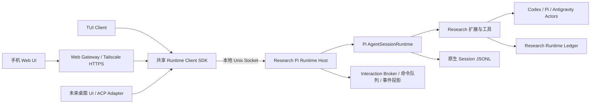

# Research Pi：UI 与运行时分离方案

调研日期：2026-10-06（Asia/Tokyo）。本文件是修改方案，没有改变当前运行中的 Pi。

## 1. 建议与边界

保留 Pi 1.0 的 AgentSession、原生认证、SessionManager、工具执行和扩展机制；新增常驻的 Research Pi Runtime Host，TUI 与 Web 都作为客户端。采用窄范围的结构化命令、状态和事件接口，而不是把 TUI 画面当成协议。

选择 **Pi SDK + 本地常驻服务** 为主线。原生 RPC 用于参考协议和快速验证，不把它直接包一层就当作功能完整的最终实现。ACP 后续可作为编辑器适配层；不替换现有 Runtime 业务模型。

这里区分三个概念：

- AgentSession：正在执行的模型循环、工具调用、队列与上下文。
- Research Runtime：项目状态、Actor、消息、Action、权限与科研记录。
- Runtime Host：常驻进程，拥有前两者，并向不同 UI 提供接口。

当前“Runtime”项目账本本身并不拥有全部活跃执行状态。只把账本搬到后台，仍无法实现 UI 退出后 Leader 持续工作。

## 2. 外部设计与采用方式

完整外部证据见 [框架调研](./ui-runtime-framework-research.md)。

| 框架 / 接口 | 核心做法 | Research Pi 采用什么 |
|---|---|---|
| Codex App Server | Thread / Turn / Item；请求、通知与服务端发起的审批；本地传输与历史读取 | Session / Turn / Item 分层、结构化审批、客户端不掌管执行循环 |
| OpenCode Server | 无界面服务提供 API，客户端订阅事件 | 常驻服务、统一客户端 SDK、Web 与 TUI 使用同一业务入口 |
| Claude Agent SDK | 宿主调用 SDK、消费异步消息并回答工具权限请求 | SDK 宿主拥有执行生命周期；SDK 本身不是现成的多客户端守护进程 |
| ACP | Agent 与编辑器之间的协议，包含 Session、更新和权限请求 | 作为后续外部 UI 适配协议；不把协议等同于持久化、常驻与断线恢复 |
| 当前 Pi 1.0 SDK / RPC | 已有 Session 生命周期和 JSONL 命令；普通扩展对话框可转发 | 复用引擎和会话文件，补足 Research Pi 特有的 UI 与服务生命周期 |

Codex 官方 App Server 文档提供初始化、历史读取、运行事件与审批接口；TCP WebSocket 仍标注 experimental/unsupported，不能将所有传输视作同样稳定。官方架构文章将 TUI 使用 App Server 描述为迁移计划，而不是所有版本已完成的保证。[App Server](https://learn.chatgpt.com/docs/app-server)、[官方架构说明](https://openai.com/index/unlocking-the-codex-harness/)。

OpenCode官方提供独立server和连接已有server的SDK；当前源码SSE没有事件id回放，客户端需要状态补取。Claude SDK的resume恢复历史，不提供多UI事件总线。ACP当前稳定路径以Client启动Agent的stdio为主，远程传输和v2存在草案边界。这些差异决定了Research Pi必须自己定义生命周期和重连语义，不能只套一个现成协议。[OpenCode Server](https://docs.opencode.ai/docs/server/)、[SSE源码](https://github.com/anomalyco/opencode/blob/dev/packages/server/src/handlers/event.ts)、[Claude SDK Hosting](https://code.claude.com/docs/en/agent-sdk/hosting)、[ACP Transports](https://agentclientprotocol.com/protocol/v1/transports)。

本项目最接近的实现路径是 OpenCode 的服务模式，交互对象与审批借鉴 Codex；不需要更换模型引擎或把项目改成新的通用 agent 框架。

## 3. 本地已确认的障碍

检查对象为已安装的 `@earendil-works/pi-coding-agent@1.0.0` 与当前 Research Pi 源码。

| 当前部件 | 已有能力 / 耦合 | 修改决策 |
|---|---|---|
| `AgentSessionRuntime` | 管理 Session、cwd 服务、new/resume/fork/import/dispose | Runtime Host 的执行基础；从当前固定版本公开 SDK 入口核对并接入 |
| 原生 `rpc-mode` | prompt、steer、follow-up、模型、历史、树、普通对话框 | 复用语义；其 `ui.custom()` 返回 undefined，组件工厂不能直接跨进程 |
| `InteractiveMode` | 构造参数是本地 AgentSessionRuntime，调用具体 Session 与 TUI 对象 | 不是可直接换成网络对象的客户端；复用渲染组件，增加独立客户端入口 |
| `research-web.ts` | UI 补丁、Session 事件、Actor 命令和 IPC 在 TUI 进程中 | 业务命令移入 Host；浏览器桥接移入 Gateway |
| `research-runtime.ts` | 项目账本/消息逻辑与 `ui.custom`、widget、renderer 混合 | 业务与视图分离；面板输出纯数据 |
| `project-boundary.ts` | 权限处理依赖 `ctx.hasUI`；修改进程级 TMPDIR | 使用结构化 Interaction Broker；保留工作区进程隔离 |
| `/watch` | 入口直接打开终端 UI | Actor 读取/订阅/投递变成服务接口；各 UI 分别渲染 |
| `web-launcher` / tmux | Web Host 管理 PTY，停止信号可结束 Pi | Gateway 退出不结束 Runtime；tmux 退为旧模式兼容 |

本地依据：[SDK](../node_modules/@earendil-works/pi-coding-agent/docs/sdk.md)、[原生 RPC 命令](../node_modules/@earendil-works/pi-coding-agent/docs/rpc-commands.md)、[Runtime Host 类型](../node_modules/@earendil-works/pi-coding-agent/dist/core/agent-session-runtime.d.ts)、[RPC UI 实现](../node_modules/@earendil-works/pi-coding-agent/dist/modes/rpc/rpc-mode.js)、[InteractiveMode](../node_modules/@earendil-works/pi-coding-agent/dist/modes/interactive/interactive-mode.d.ts)。业务源码见本节对应文件。

不能靠设置 `hasUI=false` 完成迁移：这会让部分权限处理不可用。也不能简单设置 true 而保留无操作的 `ui.custom()`：那会产生空选择或绕过预期交互。

三条路线的取舍：直接换成 OpenCode 会同时替换引擎、扩展和会话体系，超出这次目标；给原生 Pi RPC 加常驻转发层可快速做 P0，但仍需解决自定义交互和单客户端进程拥有者；直接使用 Pi SDK 构建 Host 能保留现有 Research 服务并控制交互生命周期，推荐作为最终路线。原生 `RpcClient` 会自行 spawn agent，不能让每个 UI 各创建一个 RpcClient，否则又变成多个独立运行时。

## 4. 目标架构

一个工作区默认有一个常驻 Leader Host；Analysis 使用独立的会话 Host，不争夺 Leader。初期不在同一 Node 进程塞入多个工作区：当前环境变量、沙箱配置与模块级适配器具有进程级状态。可先沿用工作区注册目录管理不同 Host，无需先建设全局调度服务。

连接注册信息区分 workspace、role、hostId 和 sessionId；Gateway路由到指定Host，而不是把“当前Session”做成所有客户端共享的可变全局变量。不同客户端可查看不同Actor或Session；同一个执行Session仍只有一个Host拥有。

Host 是唯一的 Session 写入者和执行拥有者。TUI/Web 不自行启动第二个同 Session 模型循环，不加载执行扩展，也不重新组装提示词。

`pi` 启动或接入 Host，再打开 TUI；关闭 TUI只断开客户端。`pi web start/stop` 管理 Gateway，不终止模型循环。新增明确的 `pi runtime status/stop` 管理 Host，停止时展示正在运行的 Action 并按现有取消语义处理。可在验证完成后用 macOS launchd 管理常驻服务；进程常驻不等于已保证模型循环崩溃恢复。

## 5. 足够小但完整的协议

定义共享类型与客户端库，避免 TUI/Web 分别实现一套业务判断。使用 JSON-RPC 2.0 风格的命令与通知；第一版本本地 Unix Socket 可用 JSONL，Gateway 转为浏览器 HTTP/WebSocket。传输格式由 Research Pi 自己确定，不必逐字复制外部框架。

| 对象 | 初始操作 |
|---|---|
| Connection | `initialize`、能力协商、订阅、断开 |
| Session | list/read/attach/new/resume/fork/tree；模型与 thinking 读取/变更；compact |
| Turn | start、steer、follow-up、interrupt；明确 accepted/queued/handled，不把 accepted 当 completed |
| Runtime | 项目快照、健康状态、Actor 列表、Actor 历史/订阅/消息投递 |
| Interaction | pending/list、answer、resolved/cancelled 通知 |
| Commands | 命令目录、结构化执行、配置读取/修改 |

每次变更请求包含 `requestId`、`sessionId`、`sessionEpoch`；响应返回处理结果。转发重试只针对相同 requestId，Host 返回已有回执；同一 Host 生命周期内确保不会因为网络重发启动第二次执行。Host 重启后不能证明已执行的操作标为结果未知，不宣称磁盘外部副作用 exactly-once。

事件至少含 `hostEpoch`、`sessionId`、`seq`、`type`，运行相关事件附 `turnId` 与 `itemId`。主要事件为 message delta/completed、tool started/progress/completed、turn state、queue changed、Actor changed、interaction requested/resolved、usage updated。

### 断线与恢复

连接时返回同一状态边界的 snapshot 与 cursor，再接续 cursor 之后的事件，避免“读取快照后、订阅前”丢消息。Host保留有界内存事件缓冲；游标过旧时返回 `resync_required`，客户端重新取快照和分页历史。

原生 Session JSONL 仍是对话历史权威记录，Research Ledger 仍是项目/Actor 权威记录；不另建第三份对话数据库。流式输出是活跃 Item 的内存投影，快照含当前未完成内容，因此重连不需要重发 prompt。Host重启会改变 epoch：恢复已持久化历史，但明确标记未完成 Turn，不能承诺恢复同一条在途网络请求或自动重放工具。

客户端慢或屏幕冻结不反压模型循环；可合并文本 delta，最终完整消息及状态必须能通过快照获得。为初期需求先做内存缓冲与快照，不做全量持久事件平台。

### 多 UI

允许多个 UI 同时查看，也允许它们提交操作；Host 按 Session 串行接受。忙时明确选择 follow-up 或 steer，不默默再开一个执行循环。会话切换和模型变更检查 epoch 与忙状态，旧界面的操作拒绝并要求刷新。

不增加复杂的长期写入租约：用户主要是在电脑和手机之间切换。依靠统一队列、requestId、epoch和审批原子结算解决实际重复操作。

## 6. 交互和审批必须归运行时所有

Interaction Broker 保存请求及等待中的 Promise；UI 只是展示和回答。请求包含 interactionId、sessionEpoch、Actor/Turn、类型、标题、选项或字段、权限目标和当前状态。

- 普通 select/confirm/input/editor 映射为结构化交互。
- 工具授权保留现有权限账本与精确作用域；不因手机接入或 UI 更换重新赋权。
- 两个客户端同时回答，Host 只接受第一个仍有效的答案，广播 resolved；其他客户端关闭同一个提示。
- UI 断线不等于用户取消，不自动允许工具；未处理请求保持 pending，重连接着处理。显式超时/取消按已有策略执行。
- Session切换、Actor退出或工具请求失效时取消对应 Interaction；旧回答不能授权新动作。

Runtime面板、模型选择器、配置页不应该把任意 JS 组件工厂序列化。定义少量 viewModel，如 `runtime.board`、`actor.watch`、`model.picker`、`config.form`，TUI/Web各自渲染。未知插件视图返回明确“不支持”；涉及授权时保留等待或拒绝，不能返回伪造的成功。

`ctx.hasUI` 初期表示 Host 具有结构化交互通道，客户端是否在线是独立状态。逐步把 Research 扩展的业务判断从 hasUI 改为 interaction capability，把通知/widget渲染从权限判断中拿开。

## 7. 功能迁移与代码划分

| 部分 | 具体改动 |
|---|---|
| 新 Host | `.pi/lib/runtime-host.mjs`：创建原生 Session Runtime、会话命令、订阅和关闭 |
| 共享协议/客户端 | `.pi/lib/runtime-protocol.*`、`runtime-client.mjs`：类型、错误、能力和连接 |
| 交互 | `.pi/lib/runtime-interactions.mjs`：普通对话框、审批和视图请求 |
| Research Runtime | 从 `research-runtime.ts` 提取可复用服务接口；保留现有账本和 Attachment 语义 |
| TUI | 新客户端入口和渲染层；复用 Pi TUI组件、主题和 Markdown渲染，不用假的 AgentSession 代理冒充本地实现 |
| Web | `web-server.mjs` 只做鉴权/转发/资源服务；`web/app.js` 用共享接口；逐步删除注入 Enter、setEditorText 执行业务命令 |
| `/watch` | Actor消息读取、订阅、发送在Host；TUI与Web使用同一viewModel和回执 |
| `/login` | 认证仍在电脑Host；UI渲染设备码/授权链接等必要信息，不向浏览器传递原始OAuth token |
| 生命周期 | `bin/pi.mjs`负责start/attach选择；旧tmux路径保留迁移期开关，终端尺寸不再送到Host |

斜杠命令分三类：会话操作（如 resume/model）映射结构化方法；提示词/skill由Host按原生规则展开；视图命令（如 watch/runtime/config）请求客户端视图。完整命令目录必须覆盖既有功能，并标记尚未迁移的命令；不能用“未知命令发给模型”掩盖缺失。

功能一致的含义是使用同一命令、数据与权限语义，而不是要求不同UI像素一致。`/watch`的列表、历史、工具活动、状态、输入和回执一致，手机可以用适合窄屏的布局。

## 8. 与缓存、安全、已有会话的关系

UI连接/断开、切换页面、调整尺寸、语言与样式只改变客户端状态，不进入模型上下文，不重建Session、不修改工具集合或cache key。上下文由Host沿用目前固定ProjectView和追加消息设计。

保留native SessionId、认证存储、模型覆盖、压缩阈值与当前前缀审计。将最终请求指纹记录留在Host，UI订阅usage；不让UI参与缓存参数选择。UI分离可以消除由UI生命周期引起的上下文变动，但不能保证服务端缓存驻留或消除所有零命中。

本地Socket放在用户私有目录，限制同用户访问。手机继续使用当前Tailscale网络、HTTPS和已有身份校验；Gateway校验来源与权限后转发，不直接暴露裸Runtime Socket。服务接口只返回公开投影，隐藏系统上下文、权限凭据与内部路径中的秘密；权限仍在Host执行。

现有 Session JSONL和Research Ledger直接读取；客户端历史分页不截断模型上下文。已有正在运行的TUI进程不会被“热搬移”为Host：先保留旧会话运行，在自然空闲后用同一历史接入新Host，并重新确认Leader Attachment。不能让新旧两个进程同时成为同Session写入者。

## 9. 分阶段实施与验收

| 阶段 | 实施内容 | 决策性验收 |
|---|---|---|
| P0：最小分离原型 | 独立worktree；固定Pi版本；SDK Host + 两个简易客户端；合成provider与普通交互 | 关闭全部UI后工具/回复仍完成；重连看到历史、活跃输出与待处理审批；第二客户端不启动第二循环 |
| P1：统一服务接口 | Session/Turn/Actor/Interaction、事件快照/游标、epoch、Research扩展业务拆分 | 并发重复发送只有一个回执；两个界面回答审批只结算一次；切换Session拒绝旧操作；关键消息不因重连丢失 |
| P2：TUI成为客户端 | 对话、工具渲染、输入、model/resume/tree/compact/login、Runtime/watch/config | 现有TUI主要操作逐项对照；手机resize不影响电脑；TUI退出不dispose Session；核心与UI进程可分别重启 |
| P3：Web切换 | 手机使用同一客户端接口、补齐选择器和审批；Gateway独立启停 | 手机可完整恢复历史与Actor；Web关闭/重启不停止Host；无需使用远程终端才能完成已迁移命令 |
| P4：默认启用 | `pi`默认start/attach；处理旧resident交接；移除核心路径PTY依赖 | 现有工作流、原生认证/上下文设置、Analysis和Subagent范围保持；保留可回退的旧模式至实际使用验证完成 |

每阶段一个可运行结果，不先实施全局多用户服务、通用插件协议、持久流事件数据库或大规模依赖升级。P0/P1离线验证；需要真实provider时，只进行能回答迁移差异的短测试。

首要难点是扩展交互和TUI客户端化，Socket传输本身不是主要工作。新UI在P1之后才会变简单：只接客户端接口、渲染viewModel和提交操作，无需实现模型循环、工具权限、历史恢复和Actor路由。

## 10. 推荐先做的一个实验

用原生SDK在独立Host启动合成provider，连接两个简单客户端。在“工具运行 → 请求授权 → 继续生成”过程中分别关闭TUI客户端、关闭Web Gateway，再重连回答授权。

观察：Host是否持续运行；审批是否仍是同一interaction；消息是否只投递一次；两次请求的上下文前缀是否不受UI连接事件影响。任一项失败就先修正拥有者边界，不继续堆UI。通过后再移植完整TUI。

这个实验直接验证用户想要的“随时换UI而不改变运行时”，比先重画界面或扩大tmux托管更有判别力。

## 11. 本次实现

独立分支已完成 SDK Host、共享 Socket 协议、交互 broker、TUI 客户端和独立 Web Gateway，并新增桌面会话侧栏与手机结构化操作。具体使用方式、验收步骤和已知兼容边界见 [实现与验收](ui-runtime-review.md)。旧 tmux resident 不自动搬迁；用户验收前保留 worktree，不合并或推送。
